List of learning management systems
===================================

From Wikipedia, the free encyclopedia

[Jump to
navigation](https://en.wikipedia.org/wiki/List_of_learning_management_systems#mw-head)
[Jump to
search](https://en.wikipedia.org/wiki/List_of_learning_management_systems#p-search)

See also: [Category:Learning management
systems](https://en.wikipedia.org/wiki/Category:Learning_management_systems)

The following is a **list of learning management systems**
([LMS](https://en.wikipedia.org/wiki/Learning_management_system)).

Contents
--------

-   [1 Open
    source](https://en.wikipedia.org/wiki/List_of_learning_management_systems#Open_source)

-   [2
    SAAS/Cloud](https://en.wikipedia.org/wiki/List_of_learning_management_systems#SAAS/Cloud)

-   [3
    Proprietary](https://en.wikipedia.org/wiki/List_of_learning_management_systems#Proprietary)

-   [4
    Historical](https://en.wikipedia.org/wiki/List_of_learning_management_systems#Historical)

-   [5
    References](https://en.wikipedia.org/wiki/List_of_learning_management_systems#References)

Open source
-----------

-   [aTutor](https://en.wikipedia.org/wiki/ATutor)

-   [Canvas](https://en.wikipedia.org/wiki/Instructure)

-   [Chamilo](https://en.wikipedia.org/wiki/Chamilo)

-   [Claroline](https://en.wikipedia.org/wiki/Claroline)

-   [eFront](https://en.wikipedia.org/wiki/EFront_(eLearning_software))

-   [ILIAS](https://en.wikipedia.org/wiki/ILIAS)

-   [LAMS](https://en.wikipedia.org/wiki/LAMS)

-   [LON-CAPA](https://en.wikipedia.org/wiki/LON-CAPA)

-   [Moodle](https://en.wikipedia.org/wiki/Moodle)

-   [Open edX](https://en.wikipedia.org/wiki/Open_edX)

-   [OLAT](https://en.wikipedia.org/wiki/OLAT)

-   [OpenOLAT](https://en.wikipedia.org/wiki/OpenOLAT)

-   [Sakai](https://en.wikipedia.org/wiki/Sakai_CLE)

-   [SWAD](https://en.wikipedia.org/wiki/SWAD_(software))

-   [WeBWorK](https://en.wikipedia.org/wiki/WeBWorK)

SAAS/Cloud
----------

-   [CallidusCloud](https://en.wikipedia.org/wiki/CallidusCloud)

-   [Cornerstone OnDemand
    Inc.](https://en.wikipedia.org/wiki/Cornerstone_OnDemand_Inc.)

-   [DoceboLMS](https://en.wikipedia.org/wiki/DoceboLMS)

-   [EthosCE](https://en.wikipedia.org/wiki/EthosCE)

-   [Google Classroom](https://en.wikipedia.org/wiki/Google_Classroom)

-   [Grovo](https://en.wikipedia.org/wiki/Grovo)

-   [Growth Engineering](https://en.wikipedia.org/wiki/Growth_Engineering)

-   [Gyrus Systems](https://en.wikipedia.org/wiki/Gyrus_Systems_(company))

-   [Halogen Software](https://en.wikipedia.org/wiki/Halogen_Software)

-   [Inquisiq R3](https://en.wikipedia.org/wiki/Inquisiq_R3)

-   [itslearning](https://en.wikipedia.org/wiki/Itslearning)

-   [Kannu](https://en.wikipedia.org/wiki/Kannu_(learning_management_system))

-   [Latitude Learning](https://en.wikipedia.org/wiki/Latitude_Learning)

-   [Open edX](https://en.wikipedia.org/wiki/Open_edX)

-   [Udutu](https://en.wikipedia.org/wiki/Udutu)

-   [WizIQ](https://en.wikipedia.org/wiki/WizIQ)

Proprietary
-----------

-   [Blackboard Learning
    System](https://en.wikipedia.org/wiki/Blackboard_Learning_System)

-   [CERTPOINT Systems
    Inc.](https://en.wikipedia.org/wiki/CERTPOINT_Systems_Inc.)

-   [Desire2Learn](https://en.wikipedia.org/wiki/Desire2Learn) or Brightspace

-   [eCollege](https://en.wikipedia.org/wiki/ECollege_(LMS))

-   [Edmodo](https://en.wikipedia.org/wiki/Edmodo)

-   [EduNxt](https://en.wikipedia.org/wiki/EduNxt)

-   [Engrade](https://en.wikipedia.org/wiki/Engrade)

-   [GlobalScholar](https://en.wikipedia.org/wiki/GlobalScholar)

-   [Glow (Scottish Schools National
    Intranet)](https://en.wikipedia.org/wiki/Glow_(Scottish_Schools_National_Intranet))

-   [Gyrus Systems](https://en.wikipedia.org/wiki/Gyrus_Systems_(company))

-   [HotChalk](https://en.wikipedia.org/wiki/HotChalk_LMS)

-   [JoomlaLMS](https://en.wikipedia.org/wiki/JoomlaLMS)

-   [Kannu](https://en.wikipedia.org/wiki/Kannu_(learning_management_system))

-   [Latitude Learning LLC](https://en.wikipedia.org/wiki/Latitude_Learning_LLC)

-   [SAP](https://en.wikipedia.org/wiki/SAP_AG)

-   [Schoology](https://en.wikipedia.org/wiki/Schoology)

-   [Skillsoft](https://en.wikipedia.org/wiki/Skillsoft)

-   [Spongelab](https://en.wikipedia.org/wiki/Spongelab)

-   [SuccessFactors](https://en.wikipedia.org/wiki/SuccessFactors)

-   [SumTotal Systems](https://en.wikipedia.org/wiki/SumTotal_Systems)

-   [Taleo](https://en.wikipedia.org/wiki/Taleo)

-   [Uzity](https://en.wikipedia.org/wiki/Uzity)

-   [WizIQ](https://en.wikipedia.org/wiki/WizIQ)

Historical
----------

-   [ANGEL Learning](https://en.wikipedia.org/wiki/ANGEL_Learning) (acquired by
    Blackboard in May 2009)

-   [Click2Learn](https://en.wikipedia.org/wiki/Click2Learn) and
    [Docent](https://en.wikipedia.org/wiki/Docent_Software) merged to become
    [SumTotal](https://en.wikipedia.org/wiki/SumTotal_Systems) Systems in 2004

-   [CourseInfo LLC](https://en.wikipedia.org/wiki/CourseInfo_LLC) (precursor
    company to Blackboard, which became Blackboard's core technology, founded by
    [Stephen Gilfus](https://en.wikipedia.org/wiki/Stephen_Gilfus)

-   [Elluminate](https://en.wikipedia.org/wiki/Elluminate) (acquired by
    [Blackboard](https://en.wikipedia.org/wiki/Blackboard_system) in 2010)

-   [GeoLearning](https://en.wikipedia.org/wiki/GeoLearning) (acquired by
    [SumTotal](https://en.wikipedia.org/wiki/SumTotal_Systems) in 2011)

-   [Learn.com](https://en.wikipedia.org/wiki/Learn.com) (acquired by
    [Taleo](https://en.wikipedia.org/wiki/Taleo) in 2010)

-   [PeopleSoft](https://en.wikipedia.org/wiki/PeopleSoft) (acquired by
    [Oracle](https://en.wikipedia.org/wiki/Oracle_Corporation) in 2005)

-   [Plateau Systems](https://en.wikipedia.org/wiki/Plateau_Systems) (acquired
    by [Successfactors](https://en.wikipedia.org/wiki/SuccessFactors) in 2011)

-   [Softscape](https://en.wikipedia.org/wiki/Softscape) (acquired by
    [SumTotal](https://en.wikipedia.org/wiki/SumTotal_Systems) in 2010)

-   [SuccessFactors](https://en.wikipedia.org/wiki/SuccessFactors) (acquired by
    SAP in 2012)

-   [SumTotal](https://en.wikipedia.org/wiki/SumTotal) (acquired by
    [Skillsoft](https://en.wikipedia.org/wiki/Skillsoft) in 2014)

-   [Taleo](https://en.wikipedia.org/wiki/Taleo) (acquired by
    [Oracle](https://en.wikipedia.org/wiki/Oracle_Corporation) in 2012)

-   [WebCT](https://en.wikipedia.org/wiki/WebCT) (acquired by
    [Blackboard](https://en.wikipedia.org/wiki/Blackboard_system) in 2005)

10 OPEN-SOURCE E-LEARNING MANAGEMENT SYSTEMS (9 LMS + 1 Tool, 2019 Updated)
===========================================================================

[Home](https://createonlinetraining.com/)[All
Posts](https://createonlinetraining.com)...10 OPEN-SOURCE E-LEARNING MANAGEMENT
SYSTEMS...

-   [Home](https://createonlinetraining.com/)

-   [Services](https://createonlinetraining.com/10-open-source-e-learning-lms-2019/)

-   [Pricing](https://createonlinetraining.com/pricing/)

-   [Blog](https://createonlinetraining.com/blog/)

-   [Contact Us](https://createonlinetraining.com/contacts/)

Top of Form

Bottom of Form

[E-Learning](https://createonlinetraining.com/category/e-learning/)

[by CreateOnlineTraining](https://createonlinetraining.com/author/user/)
[January 9,
2019](https://createonlinetraining.com/10-open-source-e-learning-lms-2019/)

An e-Learning Management System is a very important tool for online training.
And this list can offer you 10 powerful and flexible e-learning platforms,
totally free and open-source.

**Main Criterias**

-   Web based LMS

-   Open Source

-   Free Download

So. here are the 10 open-source E-Learning platforms you may want to review.

### **Moodle LMS**

**(Moodle.org)**

Moodle is open-source web-based platform for online education, learning
management system (LMS). It fits well for corporate and academic training.

Moodle position itself as All-in-One learning software which offer several
online E-Learning features as a single package.

Moodle’s focus is on usability, it is highly flexible and fully customizable.
Moodle has large community and a lot of user guides, vast range of different
themes and plugins. A lot of modules are freely available and allow trainers and
managers to build an education environment that fits their specific needs.

Moodle comes with over hundred language packages and easy-to-use module for
translation and text contextualization.

This LMS will require of good computing resources, but it scalable to any use,
solid secure and private.

Moodle LMS allows students to be tested through various types of quizzes and
assignments. It can be integrated with classroom platform like BigBlueButton,
WiziQ and VideoWhisper

Interaction between students can be coordinated through class or general forums,
wikis and group workshops.

Moodle features:

-   Academic Education

-   Corporate Training

-   E-Commerce (with custom plugins, not included by default)

-   Learner Portal

-   Mobile Learning

-   SCORM Packages

-   Video Conferencing

-   Gamification

-   User Guides

-   Competencies Management

In the past Moodle has problems with look and feel, people sad it’s old
fashioned and very dated, however currently there are a lot of custom themes
solve this problem.

For the latest features and updates visit Moodle at
http://docs.moodle.org/en/Features

See also – [How To Install Moodle
LMS](https://createonlinetraining.com/how-to-install-and-configure-moodle-lms-with-aws-lightsail-and-ubuntu-18-04/)

### **Dokeos LMS**

**(Dokeos.com)**

Dokeos is open-source web-based e-learning system which started as a fork of the
Claroline project. It is mobile and tablet friendly and support SCORM format.

Dokeos LMS has interesting feature – multi-portal management which can be
helpful if you are planning to build more than one instance. The multi-portals
allow you to build a complex structure of separated organizations hierarchically
organized.

Dokeos LMS position itself as the only LMS that integrates Shopify. At least
this is what they said on official company website. Dokeos is FDA and HIPAA
compliant

### Chamilo LMS

(**Chamilo.org)**

Chamilo is open-source e-learning platform that is easily operated and designed
for speed and good performance.

Courses, skills and users management, certificates and social learning network
are the key features of Chamilo.

SCORM, AICC, IMS/QTI and iCal are supported by Chamilo. And this LMS also has a
shopping cart to assist you in selling your online courses and materials.

### Forma LMS

**(Formalms.org)**

Form LMS is e-learning platform developed and designed with a focus on corporate
training. They promise that their system has a modern and responsive interface,
wide range of management options for courses, materials, users, roles and
competencies, outstanding reporting. They also offering classroom management and
multiple-clients support from a single instance.

Forma LMS features:

-   Corporate Training

-   E-Commerce

-   Extensive e-learning features

-   Mobile Learning

-   SCORM Packages

-   Video Conferencing

-   Competencies Management

### ILIAS

**(Ilias.de)**

ILIAS is an e-learning open-source LMS, which might be used for learning and
collaboration. The main idea of ILIAS is not to manage courses with some
educational model but manage a content as a library by using different scenarios
and methods.

Main features:

-   Own Desktop and Repository

-   Content Management

-   Cooperation and Communication

-   Assessments and Evaluations

-   SCORM Packages Support

### Atutor

**(Atutor.github.io)**

Atutor is a simple E-Learning solution that can be used for different learning
purposes. This is web-based LMS with a minimum set of features for quick online
content creation. Trainers can aggregate, pack and deliver web-based content,
import data, and conduct e-learning courses online.

### OPINGO

**(Opigno.org)**

Opigno is Drupal CMS based e-learning LMS. It is open-source as well as Drupal.
Opingo is a framework which allows you to create your own learning solution. Out
of the box it provides just a little of functionality, which can b extended by
modules. Opigno allows you to manage courses, create quizzes and assessments,
generate certificates and use e-commerce solutions.

### PercolateLMS

**(Percolatelms.com)**

Percolate LMS trying to solve a well-known problem for many E-Learning systems.
It designed in non-technical way to give you the ability to manage your learning
program easily. Percolate LMS fits best for small companies with up to 500
learners. It allows to set up all your courses, materials and people in hours,
not days or months. Reporting with this LMS is quite easy and quick. It has
SCORM support and all general E-Learning features.

### AccordLMS

**(Accordlms.com)**

Accord LMS offer fast course creation, quick enrollments, simple administration
and engaging learning process. It fits well for a small or big company. Accord
LMS has all E-learning features including classrooms and virtual training and
can be scaled from hundred to hundreds of thousands of students. Responsive
quizzes and surveys, custom reports as well as solid enterprise features are
included in this LMS for no extra cost.

### Edu-Sharing 

**(Edu-sharing.com)**

Edu-Sharing is not a LMS. Edu-Sharing is a tool to share courses and learning
data. It provides mechanisms to create and deliver your e-learning content. So
this is some kind of e-learning cloud storage, which allows you to share your
courses.

Main features:

-   File and courses management

-   Search engine

-   LMS integration – you can integrate your LMS using a plugin

*If you want to create your own online learning spot but don’t want to go over
your budget –* [contact us](https://createonlinetraining.com/contacts/)*. We
know how to help you!*

Top 11 Free and Open Source LMS Tools for Your Small Business
=============================================================

*Published February 5th, 2019 by *[Ankit
Sharma](https://blog.capterra.com/author/ankit-sharma/)* in *[LMS](https://blog.capterra.com/articles/training-technology/lms/)

SHARE THIS ARTICLE
------------------

[142 ](https://www.linkedin.com/shareArticle?url=https%3A%2F%2Fblog.capterra.com%2Ftop-8-freeopen-source-lmss%2F&title=Top%2011%20Free%20and%20Open%20Source%20LMS%20Tools%20for%20Your%20Small%20Business)[100 ](https://twitter.com/intent/tweet?url=https%3A%2F%2Fblog.capterra.com%2Ftop-8-freeopen-source-lmss%2F&text=Top%2011%20Free%20and%20Open%20Source%20LMS%20Tools%20for%20Your%20Small%20Business&via=Capterra)[1091 ](https://www.facebook.com/sharer.php?u=https%3A%2F%2Fblog.capterra.com%2Ftop-8-freeopen-source-lmss%2F)[90 ](https://www.pinterest.com/pin/create/button/)[5](https://reddit.com/submit?url=https%3A%2F%2Fblog.capterra.com%2Ftop-8-freeopen-source-lmss%2F&title=Top%2011%20Free%20and%20Open%20Source%20LMS%20Tools%20for%20Your%20Small%20Business)

*Update Feb. 5, 2019: We’ve updated this list to remove some outdated LMS tools
that no longer meet our market definition. We’ve also updated the existing
information and the screenshots.*

A learning management system (LMS) helps businesses and educational institutions
create, track, and manage their eLearning programs. However, most tools come
with a set [pricing
model](https://elearningindustry.com/true-cost-of-a-learning-management-system) that
can be expensive for small businesses and institutions.

While finalizing the budget for LMS software, you need to consider factors such
as cost of installation, license, fees per user/course, and ongoing maintenance.
On top of the upfront fees, there may also be [hidden
fees](https://elearningindustry.com/hidden-lms-fees-consider-selecting-lms) that
could strain your tight budget.

But if you have just a handful of employees or students, then a free or open
source LMS tool is your best option. Here’s why:

-   A free LMS may have limited features, courses, and users but still gives you
    a good overview of the software as a stand-alone solution.

-   An open source tool makes its source code open to everyone to inspect,
    modify, and enhance according to their business/education needs.

Open source LMS tools are often free to use and customize—unlike proprietary
software that has restrictive copyright licenses, so you can’t change their
source code to improve the design.

**Small businesses that use free LMS tools will have lower software costs, while
still gaining the benefits of core software features. In addition, open source
LMSs allow more customization without having to purchase expensive licenses.**

While there are hundreds of [LMS
tools](https://www.capterra.com/learning-management-system-software/) out there,
only a handful are free or open source. Therefore, we created this list of the
top 11 free and open source LMS tools that are suitable for small and midsize
businesses. The order of this list may change in future updates.

We’ve also included
a [chart](https://blog.capterra.com/top-8-freeopen-source-lmss/#chart) that
provides a quick, high-level overview of all 11 products. The products are
listed in alphabetical order. Learn more about our selection methodology at the
end of this piece.

### Jump to:

[The top free LMS
tools](https://blog.capterra.com/top-8-freeopen-source-lmss/#0)

-   [Coggno](https://blog.capterra.com/top-8-freeopen-source-lmss/#1)

-   [CourseSites (Blackboard for
    Business)](https://blog.capterra.com/top-8-freeopen-source-lmss/#2)

-   [iTunes U](https://blog.capterra.com/top-8-freeopen-source-lmss/#3)

-   [LatitudeLearning](https://blog.capterra.com/top-8-freeopen-source-lmss/#4)

-   [Myicourse](https://blog.capterra.com/top-8-freeopen-source-lmss/#5)

-   [Schoology](https://blog.capterra.com/top-8-freeopen-source-lmss/#6)

   
[The top open source LMS
tools](https://blog.capterra.com/top-8-freeopen-source-lmss/#7)

-   [Atutor](https://blog.capterra.com/top-8-freeopen-source-lmss/#8)

-   [Dokeos](https://blog.capterra.com/top-8-freeopen-source-lmss/#9)

-   [Forma LMS](https://blog.capterra.com/top-8-freeopen-source-lmss/#11)

-   [Moodle](https://blog.capterra.com/top-8-freeopen-source-lmss/#12)

-   [Sakai CLE](https://blog.capterra.com/top-8-freeopen-source-lmss/#13)

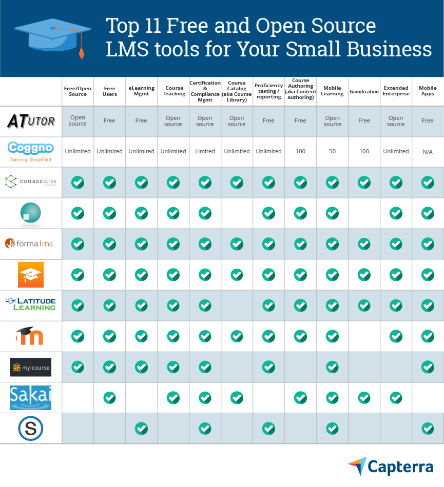

The top free LMS tools
----------------------

### Coggno: Built-in certification tool for instant certificates

Coggno is a cloud-based LMS for creating online courses on compliance, safety,
and business management. It allows you to add visual elements, such as images
and tables, to the course material. It offers courses in a variety of formats,
including video, audio, and as Microsoft Word files.

The solution has a built-in certification feature that generates certificates
after course completion. Instructors can track a learner’s progress and create
reports to measure the ROI of the training programs. In addition, course
creators can sell their courses on Coggno.com and other similar marketplaces.

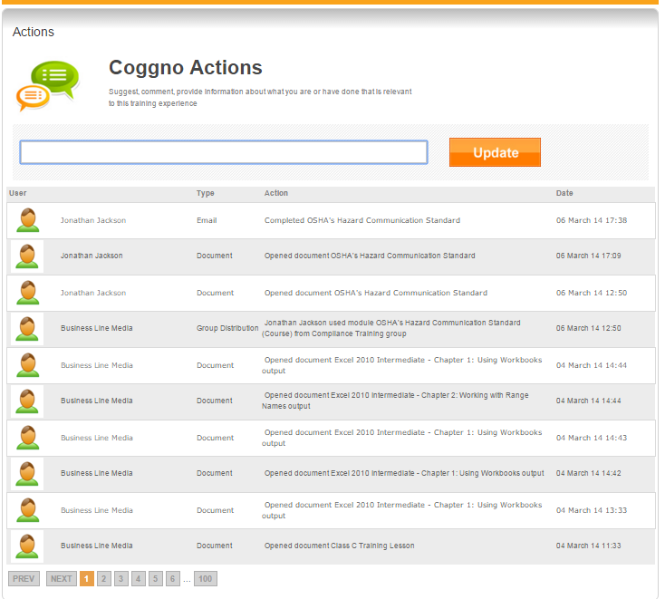

*Monitoring the training stage of employees on Coggno LMS
(*[Source](http://coggno.com/press/image-library/)*)*

** Pros:** [Capterra
reviewers](https://www.capterra.com/p/103449/Coggno/#reviews) like that they can
control and manage access permissions to the course material. They can also view
the available training courses, submit requests for registration to a course,
and send reminders for assignment deadlines and quiz dates.

** Cons:** Reviewers say that the tool doesn’t allow course customization. To
create course content, you need to
purchase [easygenerator](https://www.capterra.com/p/129281/Easygenerator/), a
course authoring tool. If you don’t want to buy a new tool, you could create
your own Sharable Content Object Reference Model
([SCORM](https://scorm.com/scorm-explained/)).

** Cost to upgrade:** Coggno is free for universities but the option to upload
additional training courses isn’t available in the freemium version. The
software is available for purchase under two plans:

-   Professional LMS at \$19 per user per year for 25-200 users.

-   Enterprise LMS at \$15 per user per year for more than 200 users.

** Mobile apps:** N/A

 Most suitable for:  Corporate training organizations and eLearning content
developers to deliver content training to their clients.

### CourseSites: Analytical insights to boost learner engagement and academic performance

CourseSites (Blackboard for Business) is a cloud-based virtual learning and
course management tool. It offers deployment options of managed hosting,
self-hosting, or software-as-a-service (SaaS).

The solution helps users create, administer, track, and deliver digital content
online. Users can access online courses, upload assignments, and interact with
classmates and instructors. The CourseSites modules consist of files for
presentations, course handouts, teaching and learning exams (TLE), and
discussion boards.

*Analytical insights on CourseSites
(*[Source](https://new.coursesites.com/index.html)*)*

** Pros:** [Capterra
reviewers](https://www.capterra.com/p/14500/Blackboard-LMS-for-Business/#reviews) say
that CourseSites is user friendly and easy to navigate. Users can upload and
access course assignments and take online tests. Some of them like the ability
to schedule online classes, personalized announcements, group emails, and
meetings in real time.

** Cons:** Some users feel that newer system updates have made it difficult to
play training videos.

** Cost to upgrade:** N/A

** Mobile
apps:** [Android](https://play.google.com/store/apps/details?id=com.blackboard.android.bbstudent&hl=en), [iOS](https://itunes.apple.com/app/blackboard-app/id950424861?mt=8)

 Most suitable for:  Businesses that train in groups or work primarily in teams
such as those in laboratory services and hospitals.

### iTunes U: Deploy training courses through mobile

iTunes U is an eLearning platform that supports course authoring, homework and
assignment distribution, integrated grading, and course forums. The content
library has courses for businesses as well as schools.

Instructors can create courses as PDFs or presentations using images, videos,
etc. iTunes U lets you work with in-app worksheets and complete lessons.

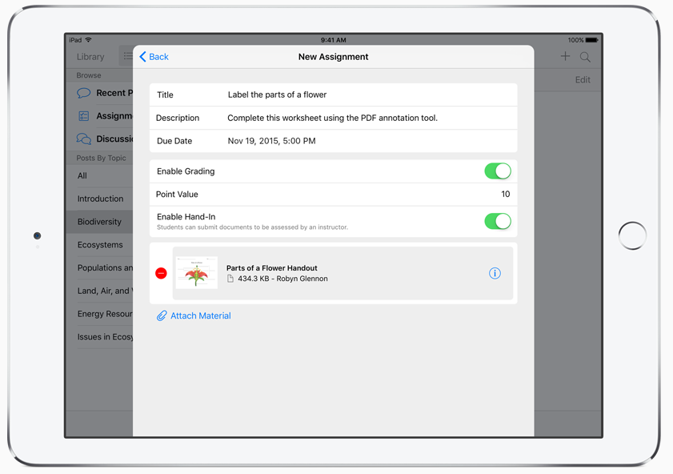

*Course creation in iTunes U
(*[Source](https://www.apple.com/education/itunes-u/)*)*

 

** Pros:** [Capterra
reviewers](https://www.capterra.com/p/177038/iTunes-U/#reviews) like that the
solution has an extensive library of high-quality podcasts and short informative
videos that cover a wide array of topics.

** Cons:** Reviewers say that the connection to iCloud is inconvenient in some
cases as it quickly consumes their limited cloud storage. They also said that
the tool takes a lot of time to boot up. The time estimates for software
updates, downloads, and syncing aren’t always accurate based on the size of the
update.

** Cost to upgrade:** N/A

** Mobile
apps:** [iOS](https://itunes.apple.com/my/app/itunes-u/id490217893?mt=8)

 Most suitable for:  Schools and colleges with students in remote locations.

### LatitudeLearning: Reporting helps measure the success of training programs

LatitudeLearning is a cloud-based LMS tool for the administration and
documentation of online courses, eLearning programs, and training content. It
works well for corporate training and B2B programs. The tool can be deployed as
SaaS or over the cloud.

LatitudeLearning’s features include certification, tracking, reporting of
training programs, and integration
with [Webex](https://www.capterra.com/p/733/WebEx-Meeting-Center/) and [GoToMeeting](https://www.capterra.com/p/163332/GoToMeeting/).

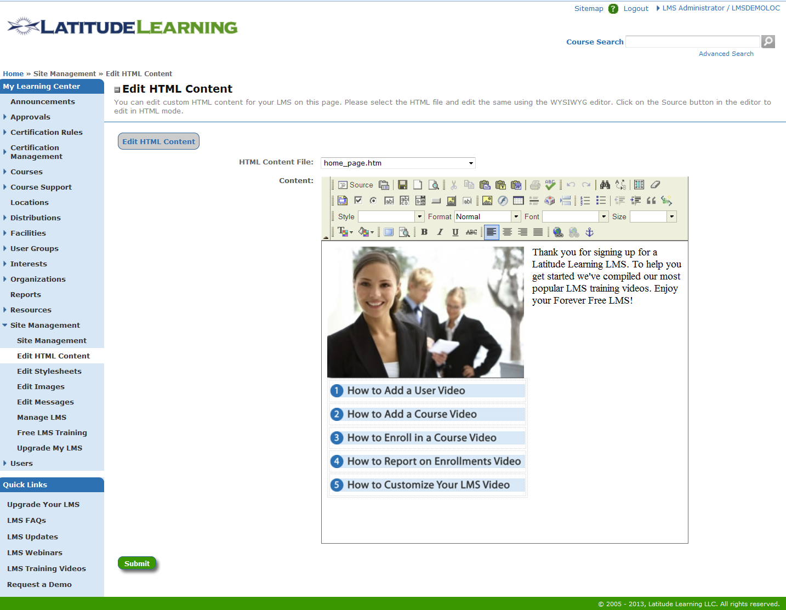

*The built-in HTML editor in LatitudeLearning
(*[Source](https://www.getapp.com/education-childcare-software/a/latitudelearning/)*)*

**Pro:** The solution provides video tutorials to help users organize courses,
manage trainees, and create reports that track a learner’s progress.

** Cons:** [Capterra
reviewers](https://www.capterra.com/p/111642/LatitudeLearning-com/#reviews) have
said that the interface feels outdated and isn’t user friendly. There is no
mobile support or third-party content library. They found that extending a
functionality could require some expensive add-ons.

** Cost to upgrade:** The standard LMS is free for up to 100 users. It offers
the following pricing plan for users who are looking to upgrade:

-   60¢ per user per month for up to 1,000 users

-   55¢ per user per month for up to 5,000 users.

-   \$2.75 per user for up to 5,000 users (the annual plan for maximum number of
    courses).

** Mobile apps:** N/A

 Most suitable for:  Small businesses that want to centralize their course
materials on the cloud.

### Myicourse: Continuing education for professionals

Myicourse is a cloud-based course creation and distribution solution for
instructors that can be used in continuing education or for business training.

The tool lets users create online “colleges” that house multiple courses. If you
want to make your courses public, you can create and run them for free. But if
you’d prefer to keep your courses private, the software is free for up to 100
students.

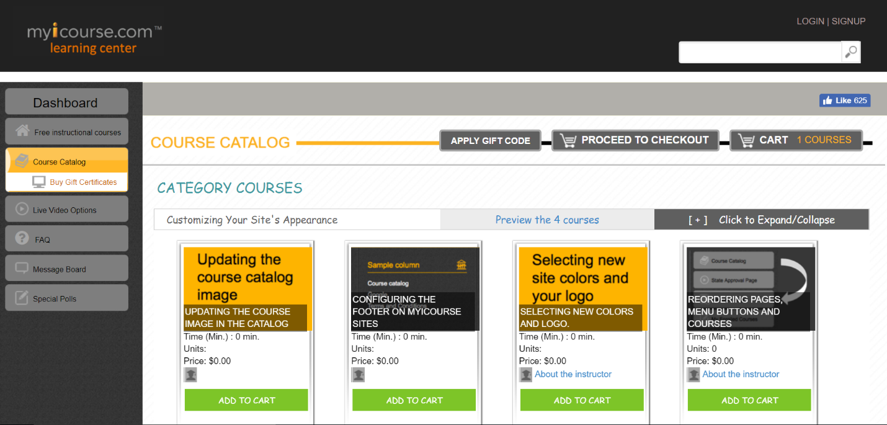

*Example of a private Myicourse college
(*[Source](https://learningcenter.myicourse.com/course_catalog/course_information)*)*

** Pros:** [Capterra
reviewers](https://www.capterra.com/p/164006/Myicourse/) like the solution’s
editing tools to customize courses. Instructors can track student traffic,
manage course sales, and offer certifications.

** Cons:** If your course content is sensitive and private, the free version may
not be for you as the courses are posted publicly. Also, as the tool is free and
limited, learners have to deal with banner ads.

** Cost to upgrade:** The software is free for public use but you can upgrade
for private usage at the following prices:

-   **Bronze:** \$50 per month for 100-500 users, with access to 500 courses.

-   **Silver:** \$100 per month for 501-2,500 users, with access to 2,500
    courses.

-   **Gold:** \$250 per month for 2,501-10,000 users, with access to 10,000
    courses.

** Mobile apps:** N/A

 Most suitable for:  Small businesses with continuing education requirements for
their employees such as staying up to date with best practices, technology, and
regulations.

### Schoology: Course management on multiple devices

Schoology is a freemium web-based LMS that hosts eLearning content such as
courses, training, and programs. It allows instructors to build reports on
learners’ performance based on course completion.

Schoology offers learning options for schools and businesses. The basic package
is free for educational institutions. It allows upgrading to an enterprise
package if you need specialized support or integration with a student
information system (SIS).

*Schoology’s course dashboard with tiled view
(*[Source](https://support.schoology.com/hc/en-us/articles/115004435948-Course-Dashboard)*)*

** Pros:** According to users, the standout features include mobile access,
Google Drive integration, content creation tools, and access to a library of
public courses and other content.

** Cons:** [Capterra
reviewers](https://www.capterra.com/p/128481/Schoology/#reviews) say that the
solution lacks a few essential features such as the ability to lock a course
folder and navigate through quizzes/tests easily.

** Cost to upgrade:** Schoology offers two packages—the basic package is free
for instructors and learners, while the enterprise package targets educational
institutes and has customized pricing.

** Mobile
apps:** [Android](https://play.google.com/store/apps/details?id=com.schoology.app&hl=en), [iOS](https://itunes.apple.com/in/app/schoology/id411766326?mt=8)

 Most suitable for:  Educational institutes that want to avoid a complicated
course-creation process—they can simply upload the courses and share those with
the students.

Top open source LMS tools
-------------------------

### ATutor: LMS for blind and visually impaired people

ATutor is a web-based LMS that offers online course management and content
authoring to create learning courses.

The authoring tool includes a web service that evaluates the accessibility of
authored content against international standards such as the American Society
for Training and Development (ASTD).

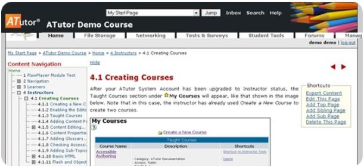

*Built-in course authoring feature
in *[ATutor](https://www.capterra.com/p/162687/ATutor/)

** Pros:** [Capterra
reviewers](https://www.capterra.com/p/162687/ATutor/#reviews) say that the tool
allows you to author courses on the platform and even import external files.

** Cons:** [Reviewers](https://www.capterra.com/p/162687/ATutor/#reviews) say
that the graphical user interface is old-fashioned, complicated, difficult to
operate, and needs to be updated.

** Cost to upgrade:** N/A

** Mobile apps:** N/A

 Most suitable for:  Nonprofit organizations or institutions that develop
instructional content and courses for blind or visually impaired people.

### Dokeos: Compliance training for pharmaceutical industry

[Dokeos](https://www.capterra.com/p/52968/Dokeos/) is an open source LMS tool
for pharmaceutical and healthcare businesses. It offers features such as course
authoring, progress tracking, reporting, and certification management.

The tool allows instructors to create quizzes or tests using 2D and 3D graphics.
Dokeos’s unique feature is Oogie Rapid Learning, which automatically transcribes
Microsoft Word and PowerPoint presentations into Dokeos slides.

The solution has compliance training programs to help businesses abide by norms
such as [Health Insurance Portability and Accountability
Act](https://www.hhs.gov/hipaa/for-professionals/index.html) (HIPAA)
and [Occupational Health and Safety Act](https://www.osha.gov/) (OSHA).

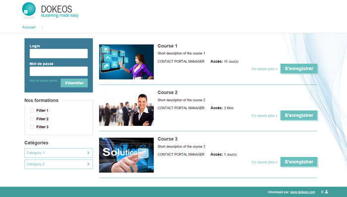

*Course management in Dokeos
(*[Source](https://www.getapp.com/education-childcare-software/a/dokeos-lms/#gallery-2)*)*

** Pros:**[Capterra
reviewers](https://www.capterra.com/p/52968/Dokeos/#reviews) say that Dokeos
offers chat and messaging to let instructors communicate with learners and
content publishers in real time.

** Cons:** They said that it lacks the ability to customize courses. Users also
noted that the response time for questions/issues on the forum and from the
customer support team is long.

** Cost to upgrade:** The solution is available for upgrade for the following
user types:

-   **Training centers:** \$250 per month for up to 50 users and \$450 per month
    for 51-100 users.

-   **Corporate organizations:** \$385 per month for up to 50 users and \$650
    per month for 51-100 users.

-   **Healthcare and pharmaceutical companies:** On demand.

** Mobile apps:** N/A

 Most suitable for:  Small businesses in the pharmaceutical and healthcare
industry that need to stay updated with regulatory compliance, auditing, and
relevant licenses.

### Forma LMS: Customized courses with built-in authoring tool

Forma LMS is an open source LMS that offers eLearning management, course
management, videoconferencing, course authoring, certification, etc.

Other features include editing tools for user management and reporting function
to collect data on learner participation in courses, completions, assignments,
etc. In addition, Forma allows you to sell your courses on its marketplace.

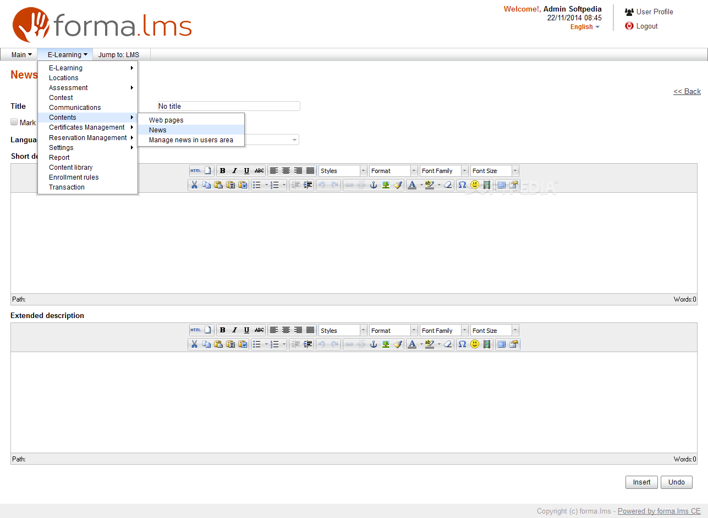

*The features dashboard on *[Forma
LMS](https://www.capterra.com/p/135235/Forma-Lms/)

** Pros:** [Capterra
reviewers](https://www.capterra.com/p/135235/Forma-Lms/#reviews) like that the
tool lets them organize courses based on categories. They can choose training
topics from a pool of the most relevant courses.

** Cons:** Reviewers said that the user interface isn’t user-friendly and there
are some minor bugs in several functions.

** Cost to upgrade:** N/A

** Mobile apps:** N/A

 Most suitable for:  Small businesses that want to promote their courses on
eCommerce platforms.

### Moodle: Drag-and-drop feature to customize courses

Moodle is a free and open source platform that lets users create customized
courses. It offers tools to manage virtual classrooms, generate certificates,
and measure the success of training programs via analytics.

Moodle’s social learning functionality allows learners and instructors to send
direct messages to each other on course forums. In addition, it has
mobile-friendly themes, support for third-party plugins (such as [Office
365](https://www.capterra.com/p/58688/Office-365/)), OneNote integration, and
the ability to sell courses via PayPal.

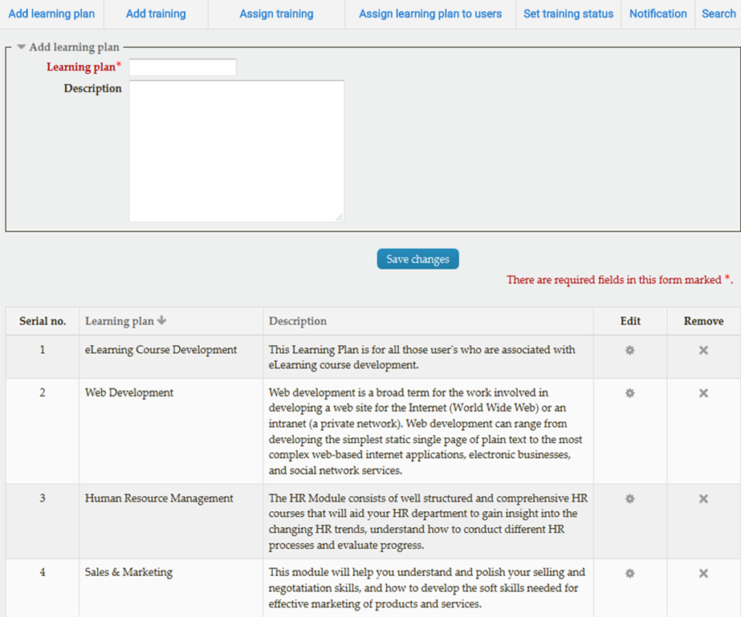

*Managing plug-ins in Moodle
(*[Source](https://moodle.org/plugins/block_learning_plan)*)*

** Pros:** [Capterra
reviewers](https://www.capterra.com/p/80691/Moodle/#reviews) like Moodle’s
simple and dynamic interface that is highly configurable. The open community
forum provides updates on add-ons, plug-ins, and resources. To find out more
about this, check out this list of [15 free Moodle
add-ons](https://blog.capterra.com/15-brand-new-and-free-moodle-add-ons-to-make-your-elessons-shine/).

** Cons:** Reviewers say that Moodle doesn’t make it easy to manage large groups
of people across multiple courses or tracks. However, you can easily manage
small groups of users per course.

** Cost to upgrade:** You can install Moodle free of cost on your server. The
paid Moodle cloud hosting packages are offered at the following prices:

-   **Starter:** \$58 per year for 50 users (ideal for a single class).

-   **Mini:** \$182 per year for 100 users (ideal for multiple classes).

-   **Small:** \$364 per year for 200 users (ideal for multiple classes).

-   **Medium:** \$729 per year for 500 users (ideal for multiple classes).

** Mobile
apps:** [iOS](https://itunes.apple.com/app/moodle-mobile/id633359593?mt=8), [Android](https://play.google.com/store/apps/details?id=com.moodle.moodlemobile)

 Most suitable for:  Schools, universities, and organizations of all sizes in
the vocational education and training sectors.

### Sakai CLE: Enhanced social learning through course forums

Sakai CLE is an open source LMS for schools that handle assignments, calendars,
grade books, tests, and quizzes. Its features include course management,
syllabus tool, and lesson builder (or course authoring tool). The solution
focuses more on academic institutions than corporate training.

Sakai offers social learning features such as multimedia course embedding, chat
functions, and video tutorial. It integrates with Google Docs and offers tools,
such
as [Wiki](https://sakai.screenstepslive.com/s/sakai_help/m/50750/l/464283-what-is-the-wiki-tool) platforms,
which allow users to author web pages without requiring advanced web authoring
skills.

*Sakai’s progress tracking dashboard (*[Source](https://sakaiproject.org/)*)*

** Pros:** [Capterra
reviewers](https://www.capterra.com/p/124698/Sakai-CLE/#reviews) say that the
Sakai community is dedicated to improve the tool’s capability. The community is
working to meet all the [W3C Web Content Accessibility
Guidelines](https://www.w3.org/WAI/standards-guidelines/wcag/) (WCAG) 2.0 Level
A and AA Success Criteria.

** Cons:** Reviewers say that interface looks old and not intuitive. The
presentation of visual elements, such as icons and buttons, could be improved.

** Cost to upgrade:** The software has no license fees and can be extended to
any number of individuals or educational communities.

** Mobile apps:** N/A

 Most suitable for:  Schools and colleges that need to create customized online
courses, track student progress, and manage various training programs.

**METHODOLOGY**

Our assessment of free and open source tools for this list was completed in the
following stages:

**Free products:**

For the purpose of this article, we classified a product as “free” if it offers
a free, stand-alone version of the software. It isn’t a trial version of the
software where you must purchase a paid version after a limited amount of time.

**Open source products:**

For open source software to be evaluated for this article, the tool has to make
its source code open to everyone to inspect, modify, and enhance. The source
code must also have been updated (full version or small fix) within the past 12
months and must support one of the following operating systems: Windows, Mac, or
Linux.

The products that met the above criteria were then evaluated against our
definition of LMS software:

“LMSs help organizations/institutes manage and automate their online teaching or
training programs.”

This check verified their basic LMS capabilities and appropriateness for the
category. We classified products as LMS software if they contained a core
feature, such as **eLearning management **and **course tracking**, and some
optional features such as certification and compliance management, course
authoring, course library, and mobile learning.”

Disclaimer: The content in this piece provides opinions and point of view
expressed by users and does not represent the views of Capterra.

**Looking for Learning Management System software?** Check out Capterra's list
of the [best Learning Management System
software](https://www.capterra.com/learning-management-system-software/)solutions.

SHARE THIS ARTICLE
------------------

[ ](https://www.linkedin.com/shareArticle?url=https%3A%2F%2Fblog.capterra.com%2Ftop-8-freeopen-source-lmss%2F&title=Top%2011%20Free%20and%20Open%20Source%20LMS%20Tools%20for%20Your%20Small%20Business)[ ](https://twitter.com/intent/tweet?url=https%3A%2F%2Fblog.capterra.com%2Ftop-8-freeopen-source-lmss%2F&text=Top%2011%20Free%20and%20Open%20Source%20LMS%20Tools%20for%20Your%20Small%20Business&via=Capterra)[ ](https://www.facebook.com/sharer.php?u=https%3A%2F%2Fblog.capterra.com%2Ftop-8-freeopen-source-lmss%2F)[ ](https://www.pinterest.com/pin/create/button/)

**Tags:** [free LMS](https://blog.capterra.com/tag/free-lms/) [learning
management
system](https://blog.capterra.com/tag/learning-management-system/) [LMS](https://blog.capterra.com/tag/lms/) [open
source LMS](https://blog.capterra.com/tag/open-source-lms/) [training
technology](https://blog.capterra.com/tag/training-technology-2/) [training
technology
software](https://blog.capterra.com/tag/training-technology-software/)

ABOUT THE AUTHOR
----------------

COMMENTS
--------

*Comment by John McDermott on November 20, 2013 at 2:13 pm*

ATutor (atutor.ca) is a standards-compliant open source LMS and associated
tools. I was surprised not to see it on the list.

*Comment by JP Medved on November 22, 2013 at 4:56 pm*

John,

Great addition to the list, and one I overlooked that I probably should have
included.

\-J.P.

*Comment by Jen Robustelli on February 28, 2014 at 5:35 pm*

We emailed, but I wanted to comment here to clarify a few inaccuracies about
Schoology in the article:

“it does suffer from an inability to assign learners to groups (as opposed to
classes)”

Actually, you CAN assign grading groups in Schoology. It’s a very popular
feature! Here’s more
info: <https://support.schoology.com/hc/en-us/articles/201001403-How-do-I-use-the-Grading-Groups-feature-in-a-course->

also,  
“the discussions feature does not allow moderating by the instructor.”

You may choose the moderation settings within a group or course, which allows
you to moderate
discussions: <https://support.schoology.com/hc/en-us/articles/201002103-Course-and-Group-Moderation>

Thanks for including Schoology in the write up.  
-Jen, Schoology Community Manager

*Comment by Chadley on April 15, 2014 at 8:11 am*

Moodle is a terrible platform, it is big complicated and lacks in predefined
lesson templates. I spent 3 months building our LMS and eventually gave up.

Dokeos actually sucks, but it looks good, and teachers are finding it is very
easy to setup a bunch of slides and build online tests. it is a nightmare to add
and remove users as they are all dumped into one list that you can flip through
page at a time. AD not LDAP intergration would be marvelous. Currently you have
to sit with the class list and find each one of the learners out of the 1000 on
the system. It creates a seperate database and folder for each course. one hell
of job to backit up.

The other LMS systems are not free and actually cost far to much in our
currency.

When will someone create a school based LMS that works properly?

*Comment by JP Medved on April 15, 2014 at 10:51 am*

Chadley,

I’ve definitely heard similar complaints about Moodle from others. You may be
interested in this piece on some cheap Moodle
alternatives: <https://blog.capterra.com/9-cheap-alternatives-moodle-small-businesses/>

Have you tried other open source options like eFront?

Jen,

Thanks for the heads up; will correct the article here shortly!

*Comment by Claudia on May 5, 2014 at 2:18 pm*

Thanks for sharing. I am using Schoology as a teacher and Moodle as a student
right now and am quite happy with it, but it is always good to know which other
options exist.

*Comment by Elouise Oyzon on June 8, 2014 at 1:09 pm*

Canvas by Instructure didn’t make the list. I just piloted it this past Spring
and found it quite good. I’m still testing it, and feel it deserves inclusion
here.

*Comment by james smith on June 27, 2014 at 5:44 pm*

Canvas isn’t free.

*Comment by Alan on July 8, 2014 at 11:38 pm*

What about ELMS by Drupal? Completely free…been testing but haven’t actually
deployed it in a working environment yet…I find it a bit complicated to manage
so far but I’m installing it with web designer’s background not a programmer…any
thoughts

*Comment by JP Medved on July 9, 2014 at 10:41 am*

Alan, good catch on ELMS! Definitely one that should be added to an updated
version of this list. What are you finding complicated about it? The
implementation, or the UI/user experience after getting it set up?

*Comment by Alberto Pastorelli on July 16, 2014 at 5:27 pm*

Forma Lms (www.formalms.org) is a free open source fork of Docebo. It’s aimed at
corporate training because in addition to the classical elearning
functionalities it comes with some business critical features (custom report
system, multi-client or brand architecture, open API, native skill management
features, and more), but it is used also in some universities.

*Comment by Anand Rajendran on July 24, 2014 at 8:37 am*

Few more open source LMS listed
here <http://www.elearningindia.in/p/oe-lms-1-66.html>

Please check the
site [http://www.elearningindia.in](http://www.elearningindia.in/) for other
categories as well.

*Comment by William on July 24, 2014 at 2:12 pm*

I am looking for a free LMS to host online course contents that can be purchased
and viewed by general public. Which one would you recommend? I have only used
the expensive LMS for corporate. Please kindly advise!

Will at [http://www.wetutoringnation.com](http://www.wetutoringnation.com/)

*Comment by JP Medved on July 24, 2014 at 2:34 pm*

Anand, that’s a great list, thank you for sharing it!

*Comment by JP Medved on July 24, 2014 at 2:38 pm*

Will, I know Latitude Learning has an eCommerce add-on that you can purchase
which allows you to sell services through the LMS, and Moodle, which is
open-source, has tons of free plugins that allow you to sell courses (the
“PayPal enrollment” plugin comes to mind). Most of these listed above should
allow the sale of courses, but some may require additional purchases to do so.

*Comment by Alan Eisenberg on July 29, 2014 at 5:30 am*

This is a good list. It always depends on what you are looking for. Totara LMS
should also be mentioned as it is a low cost, high yield companion to Moodle,
using Moodle’s engine, but with corporate and government tools.

Any LMS that you get will need training and work for Administrators to use it.
It is flexibility and ease of use usability for the end users that is key. You
can expect to work some as an Administrator or Trainer on an LMS. All of the
above require learning prior to using and there are lots of resources available
for tools like Moodle and Totara.

*Comment by Alina Toderascu on September 10, 2014 at 6:59 am*

EDU 2.0 is also a great LMS, i’m suprised it’s not on the list, the user
interface is far more beautiful and customizable than the ones on the list and
it’s really easy to use, it has e-commerce and a tone of other features.

*Comment by JP Medved on September 10, 2014 at 10:30 am*

Alina, nice addition; I hadn’t heard of EDU 2.0 before.

*Pingback by *[A Gold Mine of \#EdTech Resources: Part II \| Getting
Smart](http://gettingsmart.com/2014/09/gold-mine-edtech-resources-part-ii/)* on September
13, 2014 at 6:00 am*

[…] it so cool? It’s is free. Want to know the top 8 free and open-source LMSs?
Take a look at J.P. Medved’s […]

*Comment by Sue Hudson on September 19, 2014 at 5:30 pm*

What do you know about GoogleClassroom?

*Comment by JP Medved on September 19, 2014 at 5:51 pm*

Hi Sue,

It’s my understanding that GoogleClassroom is still very much early days. From
what I’ve seen it excels as a tool for receiving, editing/grading, and returning
student assignments, but that it’s still missing many key features that a lot of
the LMSs listed above have (like online exams). It’s also definitely aimed at
the academic (rather than corporate training) market, and specifically K-12.

I’d probably recommend waiting to see what new functionality is added to it for
now.

*Comment by Aroldo Noriega on October 5, 2014 at 2:22 am*

You totally forgot CHAMILO [http://www.chamilo.org](http://www.chamilo.org/) a
not recently Dokeos fork. Worth considering and CLAROLINE the grand mother of al
LMS.

*Comment by Delores Quinata on November 23, 2014 at 5:34 pm*

Interesting to learn of other LMS’s. I’ve used Moodle as a student and then
discovered Schoology and Canvas which I have trialed in my classroom. I like the
collaboration & communication features Canvas has, but like the way Schoology is
organized. I’ve chosen to use Schoology as my LMS. It is very student friendly
and reliable. I think it is a good platform to expose students to online/blended
learning if they’re planning to go to college.

*Comment by Scott on November 24, 2014 at 4:25 pm*

Canvas by Instructure is a commercially open-source LMS that is FREE for
individual teacher use or self-hosting, just like several of the other LMS’
mentioned above. Canvas does have an enterprise version as well that does cost
money. Canvas has over 15,000,000 users across the world.

This is a must have on this list. It is the system used by many ivy league
schools and pretty much the entire state of Utah…..

*Comment by Jorge Castro on November 24, 2014 at 5:41 pm*

I tested many and practically all of them (at least the free ones) are too
complex, too buggy and less practical.

The worst that i tried was Dokeos, i found several bugs, even bugs in the
installer!. And the forum is a no-law-man place.

*Comment by Antonio Cañas on December 2, 2014 at 7:26 pm*

OpenSWAD is another free software platform to support face-to-face and blended
learning: [https://openswad.org](https://openswad.org/)

*Comment by Harender on December 12, 2014 at 6:06 am*

Try myicourse.com , much better then many one listing in this blog. I am sure it
will help you to provide best solutions for education purpose.

*Comment by John Overland on December 18, 2014 at 5:47 pm*

Look at Varsity Learning.com LMS with math content included. Aimed at middle and
high school math teachers, but easily used for any subject. They are promising
science, language, and additional subjects next year.

*Comment by Richard Jones on January 13, 2015 at 9:11 pm*

Looking to teach art online – hopefully interactively with artwork uploaded or
shared easily in order to critique. Any thoughts on the possible platform?

*Comment by Mary Rudis on January 14, 2015 at 1:21 pm*

So three on the list aren’t really free. 100 users will easily be topped by the
majority of potential customers, and one person’s “premium” content is another
person’s “necessary”. Since you included CourseSites by Blackboard, it would
only be fair to include Pearson’s “OpenClass”. What many people don’t know is
that Pearson partnered with Google in the development of this platform.

*Comment by Michael O. on February 14, 2015 at 3:02 am*

I agree with Aroldo about Chamilo LMS. I tested several of the LMS’s on this
list (Moodle, Dokeos, and Sakai) and found out about Chamilo through a LinkedIn
post. The pros are that it is easy relatively easy to use and customize compared
to most systems; it also includes a great feature for connecting learning
modules/courses to employee skill sets and promotions (I love this feature).

The biggest con is that while it has great support, much of it is in Spanish,
but the team still answers in English if you send them an email. I have been
using Chamilo for our large industrial manufacturing company for over a year now
and I have been very happy with it.

*Comment by John Shine on March 12, 2015 at 5:24 pm*

Kornukopia is a state of the art software as a service FREE learning management
system.  
Free to use, free to try, free for life. Don’t try to implement some open source
legacy LMS before you try Kornukopia.com!

*Pingback by *[Free Open Source Learning Management System -
Financesonline.com](http://learning-management.financesonline.com/free-open-source-learning-management-system/)* on March
27, 2015 at 10:25 am*

[…] said, I have jotted down three top picks from an extensive list of popular
and widely used free open source LMS platforms. Read on and check them […]

*Comment by Jeff Nelson on April 26, 2015 at 1:54 am*

Someone commented above that “Canvas isn’t free.” This is false. Canvas is an
open-source LMS available under the GNU AGPLv3. You can download the source code
from Github. Search for canvas-lms.

Canvas is supported by Instructure, Inc. They will let you run courses for free
on their server if you don’t want to download and install it from sourcecode
yourself. I believe they also sell support contracts.

I really like Canvas; the interface is up to date and easy to use. However, I’ve
attempted to install it on a server before and didn’t quite succeed. It’s not
that it’s extremely difficult, but it’s more complicated to install than Moodle.
Canvas uses Ruby, requires more steps in the install, and I’m just not as used
to it. Moodle mainly uses PHP and Mysql and in most cases is extremely easy to
install on a LAMP server.

I’ve probably installed Moodle 100 times and have been using it and other LMSes
for about 15 years.

*Comment by Alain Ferrer on June 3, 2015 at 12:00 pm*

Is anyone aware of any LMS solutions which are .NET based?

*Comment by K Patrick on June 8, 2015 at 5:53 pm*

I have been using CourseSites for 3 years now. I like it because I can
sub-divide my students into sections, yet they can still interact with each
other via discussion boards as one large group. I can put all my background
materials there, assign them weekly journal entries, upload powerpoint
presentations, and the most important from my point of view, launch a virtual
classroom for our synchronous portion. The only thing I really don’t like about
it is that the live classroom is a bit glitchy, and at least one person is
booted off during every meeting (sometimes, it’s me, and that’s annoying!). Does
anyone know a rival to CourseSites that has this functionality for free? An
option to record the course without using 3rd party software would be a mega
bonus!

*Comment by kamesh on July 2, 2015 at 8:09 am*

Hi Guys ,  
I have reviewed the overall 8 lms.  
In my suggestion moodle always best.because i have too many reasons.  
Moodle LMS developed since 2002.now a days i have seend most advantages and
features are added. Most universities and schools are suggest and used in
moodle.  
Moodle support LTI , SCORM package , SEB(Safe Exam Browser) supported.  
Moodle mobile app available.we can change the mobile app color thorugh our site
style urls. Mobile app use underscore js and backbone js.

I have seen some free themes url below the links.  
<https://moodle.org/plugins/view/theme_essential>  
<https://moodle.org/plugins/view/theme_academi>  
<http://www.buymoodlethemes.com/free-responsive-moodle-themes>

*Comment by Yvain DEMOLLIERE on August 24, 2015 at 10:57 am*

Hi,  
you should definitely add Open edX as a LMS + CMS in your list.  
We are using it for 2 years now and it is a very great tools for both
instructors and students.

*Comment by JP Medved on August 24, 2015 at 4:15 pm*

Hi Yvain, I’m actually working on an updated list to be published in the next
couple weeks and will add your suggestion to my research!

*Comment by Jack McLaughlin on August 28, 2015 at 10:57 am*

Having reviewed nearly all of your Top 8 – I will say, without a doubt, that
Open edX is the best free, open source LMS in the marketplace.

How can you argue with Harvard and M.I.T. and the \$60M investment they have
made to teach the world? 5 million users!

If you are interested in presenting data AND collecting data in an interactive,
engaging community – where collaboration is easy and interesting with portfolios
and Google Hangouts embedded in each content collection – then edX is your \#1
choice. They should be on the top of your list.

*Comment by Trevor Haagsma on September 3, 2015 at 12:41 pm*

Personally, I like dokeos/ Chamilo the best. Open edx is also great however LDAP
and AD integration is terrible on all 3 of these great platforms. Have been
using dokeos manually with one class at our school for almost 5 years, going
well but forums can be very buggy. High hopes to get the Django plugin working
with LDAP and get open edx functional…

*Comment by Lonesome Walker on October 2, 2015 at 1:02 pm*

This article reads like a paid product placement.

Title is: TOP 8 free open source LMS  
What you get: crappy systems like moodle which are a stopper if you decide for a
LMS.  
And of course many NON-FREE systems.

Sorry dear author, you should feel ashamed a little bit.

*Comment by Alberto Pastorelli on October 4, 2015 at 8:36 am*

Still missing FORMA LMS, [http://www.formalms.org](http://www.formalms.org/) …
it’s useed by hundreds of organizations worldwide, including universities,
governements and large corporations.

It’s the only Free Open Source LMS natively featuring talent management and
white labelling for multi client installations.

Give it a try! 😉

*Comment by JP Medved on October 6, 2015 at 12:04 pm*

Hi Alberto,

Thanks for the comment, we actually included Forma LMS in the “Honorable
Mentions” section as a Docebo fork!

Lonesome Walker, sorry you don’t like the selection on this list. Moodle is used
by a lot of respected organizations and institutions, so we felt it worth
including here. Additionally, all the options on this list are free, wither by
offering a free starter version, or being open-source, or being free and
ad-supported. If you find a system that is on this list that is NOT free, please
let me know and I can remove it.

*Comment by Mansi on October 6, 2015 at 12:35 pm*

Hi, we are looking for a LMS solution to offer training to employees that can
support the following requirements mainly  
— Built-in and available training content for common courses, technical courses,
etc  
– On-demand training as and when needed by remote users  
– Ability to track training completions, users, etc  
– Ability to add custom/internal/company created training classes to platform

Which one would you recommend?

*Comment by JP Medved on October 12, 2015 at 12:44 pm*

Hi Mansi,

Most LMSs should be able to handle your \#s 2-4 (for \#4 make sure they are
SCORM compliant). You’ll likely find differentiation in which ones already offer
available course content for the subjects you need.

For that you’ll need to look through the course libraries of the individual
platforms. On this page, while Schoology offers a course library, most of those
offerings are likely to be academic-focused. You may have more luck with
something like Moodle which has tons of free, third party courses out there.

*Comment by Bill Branson on October 12, 2015 at 1:49 pm*

Canvas has a paid and an open source option. I use both – Maricopa Community
Colleges converted from Blackboard to Canvas about 3 years ago. The open source
is free and though its missing many of the paid options, it’s simple to use and
in some situations a good choice.

*Comment by Bizanosa on October 30, 2015 at 10:51 pm*

Great and useful article. I’m in the process of finding a video intensive LMS
for [http://bizanosa.com](http://bizanosa.com/), where I want to start teaching
how to build websites . Open source is a good place to start since I can then
customize it to my needs. I was more interested in a WordPress solution because
I have a lot more experience with that. Still this was a good list and will look
into all of them one by one.

*Comment by John Dougherty on November 1, 2015 at 6:55 pm*

Similar to Google Classroom (LMS), iTunes U was probably the first robust MOOC
platform as well. We’ve been using iTunes U at our residency program for a few
years now. Very easy to use, new grade book options, and if you use iBooks
Author (free), you can easily set up some very nice interactive ‘book’
assignments. Why no mention of iTunes U?

*Comment by JP Medved on November 10, 2015 at 1:24 pm*

Hi John,

Great catch! I actually mentioned them in my piece on top eLearning apps, but
failed to include them here.

<https://blog.capterra.com/best-elearning-apps-businesses/>

I’ll add them for the next update.

*Comment by Bhav Seera on November 16, 2015 at 7:46 am*

quite impressed with this article and the depth /range of it’s analysis on the
products. Will 100% bookmark this and reference to it. thanks!

*Comment by Shivankit Arora on November 25, 2015 at 5:21 am*

Here is another great resource, free LMS by coggno. I think you should add it to
list too.  
[http://www.Coggno.com](http://www.coggno.com/)  
1. A branded Training Platform for the exclusive use of your organization.  
2. Ability to upload your internal training documents, employee manuals,
processes & procedures so your employees have one convenient location to access
them.  
3. Track employee usage, view results and certificates of completion.  
<http://coggno.com/lms/free-training-platform>

*Comment by JP Medved on December 8, 2015 at 4:08 pm*

Hi Bizanosa,

If you’re looking for a WordPress-based LMS, check out this list:

<https://blog.capterra.com/wordpress-lms-comparison-7-amazing-solutions/>

*Comment by Sylvia Meireles on December 15, 2015 at 2:24 pm*

Where is Totara LMS?

*Comment by JP Medved on December 16, 2015 at 3:21 pm*

Hi Sylvia,

As I understand it Totara is a Moodle fork, is that correct? I’ll add it in a
subsequent update in the honorable mentions section if so. Thanks!

*Comment by Sherry on January 3, 2016 at 12:30 pm*

Thanks for giving many options! I’m new to this, but thinking ahead to something
I’m wanting to do. I’m looking for something comparable to an academic LMS, with
ability to have self-graded quizzes, and also discussions. I assume every LMS
allows uploading of files and videos, etc. Is there a chart somewhere that would
tell me the exact features that each of these have (as well as how well they
work for a non-tech person)?

*Comment by Ruhi Sharma on January 7, 2016 at 1:56 am*

Campus is also a web based university management ERP software. Campus is built
on a flexible technology, that makes it easy for any academic institution to
scale up or scale down their operation as per convenient

*Comment by Catharine on January 13, 2016 at 3:45 pm*

Chalkup (<https://www.chalkup.co/>) should totally be on this list. Best free
LMS I’ve used. It’s quite similar to Google Classroom, but it connects to
rubrics and has parent access in the paid version. Worth checking out.

*Comment by JP Medved on January 14, 2016 at 4:58 pm*

Hi Sherry, this is the closest chart we have right now, though unfortunately
it’s not for all these solutions:

<https://www.capterra.com/learning-management-system-software/features-guide>

We’re working on building out a more specific chart for this post shortly, so
stay tuned!

*Comment by JP Medved on January 18, 2016 at 12:51 pm*

Hi Catharine, Chalkup looks like a solid addition. I’ll make sure to add it in
the next update!

*Comment by Daljeet Singh on January 22, 2016 at 4:50 pm*

Hi ! is there any open source LMS which has options for Video Chat/
Student-tutor interactive window for online learning. I am working on a school
management system and i want to bring this available for students of the school
who want learning from home. Please help me… Thanks & Regards’ Daljeet

*Comment by Rajalakshmi on February 23, 2016 at 5:42 am*

Hi,

Please suggest a LMS which can provide feature like assessment and results,
after the classroom session is completed.  
E.g the assessment should have few questions to check the understanding of the
student on the module taught. Each and every student in that batch should be
able to take the assessment and it gives result for each and every student.  
Please help.

*Comment by Anna on February 24, 2016 at 11:00 pm*

Hi,

Thanks for the list. I’m looking for an LMS site on which I can host multiple
courses to which  
I can invite different individuals. I would like to upload
assignments/ppts/videos to it and would like it to have an auto-correct option
for the assignments. If it could be linked to a CRM that would self populate,
that would be great as well.

Which site would you recommend?

Thanks!

*Comment by Jan Procházka on February 28, 2016 at 10:50 am*

Hello, we would like to add also free e-Learning platform
– [http://www.training-online.eu](http://www.training-online.eu/). It´s cloud
based LMS and very easy and user friendly. You can also set your own languages
for every user and you don´t need any initial investment or monthly fees. and
what else you can get your provisions as an intermediary. if you need more
please contact me or read the website.

*Comment by Iris Vermeren on March 1, 2016 at 6:29 am*

Hi JP Medved,  
Great article. Choosing an open source LMS can be a difficult decision, so I’m
glad you’ve listed some of the best options out there. We would love it if you
could also review our award-winning open source platform, Totara LMS.

To answer your question, yes, last summer we made the carefully considered
decision that from 2016, Totara LMS will no longer be in lockstep with Moodle.
You can read all about it here <http://bit.ly/1MnOnIW> Feel free to contact me
if you need any further information.

Thanks,  
Iris (Channel Marketing Manager, Totara Learning)

*Comment by JP Medved on March 29, 2016 at 12:24 pm*

Iris,

Very interesting! I’ll take a look and make sure to include in the next update.

Cheers,  
J.P.

*Pingback by *[ID and E-Learning Links (4/3/16) \| Experiencing
E-Learning](https://christytucker.wordpress.com/2016/04/03/id-and-e-learning-links-4316/)* on April
3, 2016 at 5:03 pm*

[…] The Top 8 Free/Open Source LMSs – Capterra Blog […]

*Comment by Mirzi Betasolo on April 8, 2016 at 10:21 am*

Google Classroom now had improved. It has an addition to create a quiz in Google
Forms, except that the auto marking is not yet in place. Google forms also have
other features such as creating a worksheet, and survey. Aside from the features
as mentioned earlier, posting can be moved to the top so students will be
reminded to work on pressing deadline. Other apps like Google doc (a word doc
that is working in real time or offline), Google sheet (an excel format in real
time), Google Slide (powerpoint that shows real time works), including Google
site where you can create your classroom website. Just like any other classroom
(non-virtual) we bring teaching tools into our classrooms, Google classroom
works the same, and I found it compatible with other free apps available on the
web for hosting online quiz such as ProProfs. Hoping for more new features by
Google in the future, so give a try to Google Classroom.

*Comment by Adam Thomas on April 13, 2016 at 2:53 am*

Thanks for the help. I am currently looking for an LMS fit with my company’s
requirements and want to throw a comment out there …

It takes literally hours to set up and evaluate a web-based LMS. It takes almost
as long to get pricing information out of some of these companies!!! I’m afraid
that I look at their web-sites and, if I can’t find pricing within 15 minutes, I
move along to another platform. I don’t need some sales person to call me and
explain a pricing structure that could be written in a couple of hundred words
(or 30-50) – the fact that I’m shopping for an LMS surely means that I’m
sophisticated enough to handle that level of complexity!! They seem to think
that the word ‘free’ next to the word ‘download’ will make me invest four or
five hours before I’m sure if my boss will sign off on the cost – what planet do
they live on?  
Rant over …  
Many thanks for the blog.

*Comment by Adam Thomas on April 13, 2016 at 3:05 am*

Regarding Training Online.eu (see above) – a classic case of hidden costs. You
are given 30USD which is spent in some unspecified manner when students access
content. Spent 15 mins to discover this after wading through some very
non-standard English usage. Was unable to discover more before the 15 mins
elapsed so its on to the next …

*Comment by Jim Burzo on November 8, 2016 at 1:06 pm*

I’m doing 1-on-1 training with Photoshop, Lightroom, NIK, and other photographic
applications. I need an LMS that’s easy to use, both for myself and students.
I’d like it to be web based but not data intensive. I’m a photographer who is
sometimes in remote area’s with only a Verizon Jetpack. Suggestions?

*Comment by Chris S on November 22, 2016 at 2:21 am*

JP – would like to show you something interesting we’ve built. We’ll definitely
be more modern than many on this list but, like Chalkup, we don’t identify with
most LMS’. We’ll serve the hospitality niche particularly well, with intentions
to expand through retail, pharma, and financial services. Send me an email and
I’ll send some demo links. Thanks

*Comment by VR on January 14, 2017 at 2:15 pm*

Um….. Google Classroom does have automatic grading. Forms.google.com

*Comment by Tung ND on February 16, 2017 at 2:54 am*

Hi JP, some of the mentioned LMS is now very old and outdated. For example
OpenClass will retire next year. Instead, it’s my opinion that newer, better LMS
solutions like EdX, Google Classroom should be moved to the first places instead
of being buried somewhere hard to see in the list.

Also, can you consider adding LearnPress WordPress LMS to the list?  
It’s a completely free Open Source LMS that runs on WordPress and is frequently
updated, maintained: <https://wordpress.org/plugins/learnpress/>  
According to stats on WordPress, LearnPress now is the WP LMS that has the most
active install.

Thanks 🙂

*Pingback by *[EdTech Exploration Plan \| Jim Hounslow's Blog and
ePortfolio](https://jhounslow.wordpress.com/2017/03/25/edtech-exploration-plan/)* on March
25, 2017 at 2:07 pm*

[…] Medved, J.P. (2016). The Top 8 Free/Open Source LMSs. Retrieved
from: <https://blog.capterra.com/top-8-freeopen-source-lmss/> […]

*Comment by Jerry Mahun on May 7, 2017 at 7:35 pm*

I tried creating an account at Blackboard’s CourseSites but couldn’t because it
requires my educational institution. Does that mean CourseSites is only for
school teachers? I’m a consultant and continuing education provider, does then
mean I can’t use it?

*Comment by WizIQ on September 8, 2017 at 2:55 am*

If you are struggling to create the LMS using open source try WizIQ.  
This is a cloud based e Learning delivery platform easy to integrate with top
known open source – Advanced open inetgration, Moodle, Blackboard, Joomla,
Sakai, WordPress, Drupal, efront, edmodo, totaralms and canvas.

*Comment by Hianna Sabo on October 12, 2017 at 11:54 am*

I wanted to mention Eliademy. easy to use.  
<https://eliademy.com/>

*Comment by Andrea Hall on November 9, 2017 at 12:55 am*

Thanks for all the interesting info. I am however confused as to why you say
opensource requires extra support, and the extra costs for setting it up. I have
used two propriety LMS- WeCT and Blackboard, and one open source- Moodle. Moodle
was by far the easiest to use, the least learning curve for everyone, and by far
gave the best support for issues. And we did not need to spend anything extra
for additives, moodle and their free plug ins had all we need. There are many
companies that can be contracted to provide all the support needed, at way less
the price of Blackboard etc, it was a huge savings to have moodle with far
better support. When we had WebCT the support was extremely poor, took forever
for them to fix our issues. Friends who used Blackboard extensively found the
same problem.  
We tested moodle and WebCT side by side at our uni before selecting moodle, and
the users overwhelmingly approved of this opensource LMS So really I am not sure
where you are coming from (and no, no one is paying for my post, I just think
there needs to be expert users from open source to contribute to content) Thanks

*Comment by Chamilo on January 25, 2018 at 12:48 pm*

“Chamilo is a clever system, however, it is absolutely a fork; it can’t quite
stand up on its own, that is to say, it doesn’t add much to the original
Dokeos.”

I don’t know who wrote this article, but if you compare both you will notice
pretty fast how outdated Dokeos is.  
Social learning, skill wheel, open badges support,… seriously Chamilo is now a 6
year old fork with a totally different code base 😉

*Comment by Stefan Stefanov on January 24, 2019 at 10:15 am*

I am looking for LMS  
My main concern is to be deploy-able on a local server, but still to be able to
be used as WEB LMS.

List of required features:  
– Deploy-able on local server, not cloud-based  
– Virtual classroom  
– Adding/Deleting/Updating learning material  
– Creation/Approval/Verification of tests  
– Creation/Approval of polls  
– Certificate generation

Could you recommend me such an LMS? Even if it does not have all the listed
required features.  
Thank you in advance!

开源学习系统汇总
================

发表于 2016-12-26 \| 分类于 [share](http://www.pangxieke.com/category/share/) \|
阅读次数: 142

公司需要搭建在线学习平台，查找相关资料，网络上有许许多多的在线学习平台，但想要选到适宜的却不是简单之事。本文罗列了8款最好的开源在线学习平台，基于这些平台提供强大的功能及安全的用户界面，从而帮助Web开发者大大提高工作效率。

eFront Learning
---------------

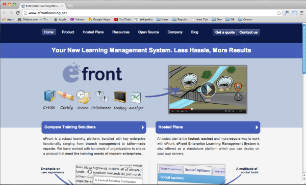

5379bf3d8de57

efront是一套功能齐全的在线学习管理系统，其拥有强大的功能，可创建、访问、评估、分析与协作，它能够让管理员利用其提供的各种工具来创建和管理课程。同时它还作为一个独立的平台，基于此你可以部署在自己的服务器上。

**Moodle**

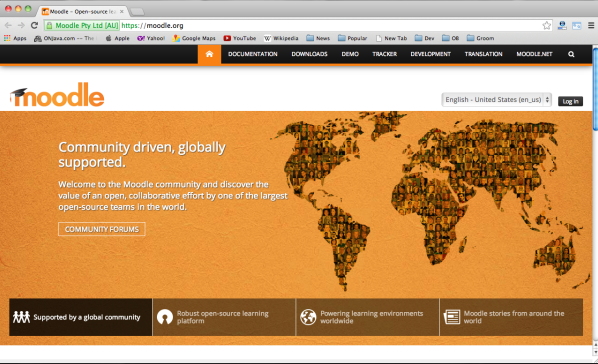

5379cb624ae12

Moodle是一个开源课程管理系统（CMS），也被称为学习管理系统（LMS）。它已成为深受世界各地教育工作者喜爱的一种为学生建立网上动态网站的工具。用户需要将其安装在Web服务器上，无论是在自己的电脑或网络托管公司。Moodle平台界面简单、精巧。使用者可以根据需要随时调整界面，增减内容。

官网地址：<https://moodle.com>

Github地址：<https://github.com/moodle/moodle>

Ilias
-----

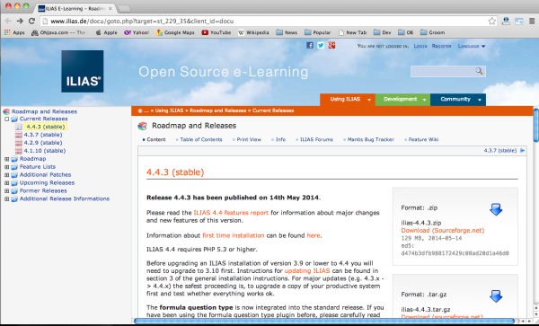

5379cb7e7f641

ILIAS是一套基于Web的学习管理系统。提供课程管理、邮件、即时对话、论坛、团体协作、文件共享、写作工具、考试系统、个人桌面等。提供上下文帮助系统用于学习和写作。

Dokeos
------

5379cb8ec4d0f

Dokeos是一款很好的在线学习管理系统，基于开源软件标准，采用PHP语言开发，因此，来自世界各地的软件开发者可以以插件的形式不断完善其焦点功能。其主要特性有：创建在线培训课程、整合现有内容、可在所有设备上运行、无需安装，用户可以自主地根据实际需求开发新的功能。

官网地址：<http://www.dokeos.com/>

Sakai
-----

5379cb9c70d15

Sakai是一个自由、开源的在线协作和学习环境，由Sakai成员开发和维护。Sakai是一基于Java的面向服务的应用程序，具有可靠性、协作性和可扩展性。

**Claroline**

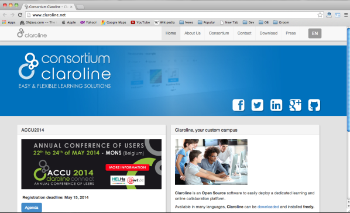

5379cbb1bbbbf

Claroline是一个开源的优秀eLearning和eWorking系统，它的设计目标是建立一个高效的、易操作的在线学习和课程管理系统。它特别强调合作性学习活动的管理，支持学习路线、学习追踪功能、内置wiki、小组协作、在线练习和作业、支持实时在线交流。

Atutor
------

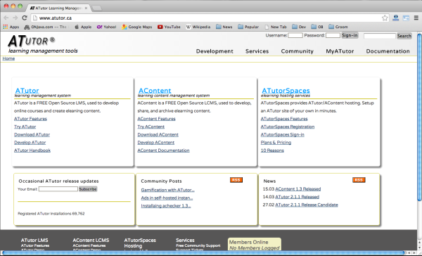

5379cbc374ebd

是一款免费的开源的学习管理系统，常用于开发在线课程。用户可以在线学习，快速对基于Web的教学内容进行装配，打包和重新分配。

Olat
----

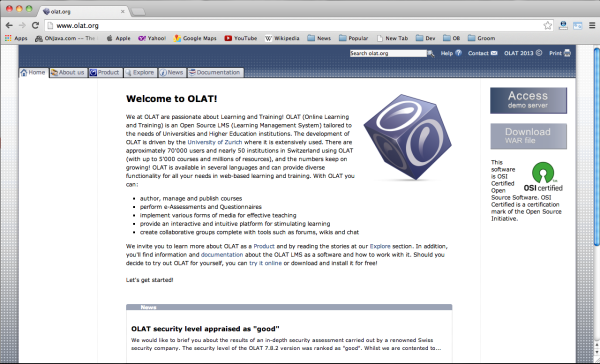

5379cbf5beac8

Olat是一个基于Web的开源学习管理系统/内容学习管理系统。它基于纯HTML的GUI。OLAT的课程编辑器可以在很短的时间内创建一个新的课程，它的课程系统是基于IMS学习设计的思想。

混战多年，K12在线教育的故事讲到哪了？
=====================================

[鲸准干货](https://36kr.com/user/900325176) *·* 2017-08-25

在线教育机会太好了，而且功德无量。

编者按：本文由微信号[“鲸准”（ID：rong36kr）](http://mp.weixin.qq.com/s/VBizi6DXdnzFpsQELcDVLw)原创，作者梁小妖；经36氪授权发布。

**教育，是一条永不过时的赛道，只要一有机会，就会蹿起来。**

业界称2016年是在线教育元年，虽然很多公司和机构早就在默默耕耘，真正走上战场来的也就在这一年。K12是在线教育中特别重要又极其特殊的领域，是指从小学到高中的12年基础教育阶段，
这一阶段覆盖时间长，用户规模大且属于刚性需求，发展想象力非常丰富。

另一方面，政策的利好（教育投入增加、二胎政策）和互联网技术（大数据、AI）的发展，使得K12教育有太多可以讲的故事。2016年全国K12阶段在校学生数量超过1.8亿，这一人数还将逐渐增加，并且年轻一代的父母们越来越有购买力，接受创新。

于是，在互联网终于入侵传统的不能再传统的教育行业后，K12成为了创业公司最为密集的赛道，各种商业模式不断被探索，“热点”几乎以半年为一周期“更迭”。从在线辅导，到拍照搜题，再到STEAM教育，引发了一波又一波的小高潮。

**然而，学习是件反人类的事情。**

尤其是未成年人这个特殊的群体。不同于文化娱乐和消费生活的欣欣向荣，教育行业尤其是K12，在这条赛道上走的跌跌撞撞，因为K12其实是一种“被（家长）刚需”。

那么，这个市场到底需要什么样的公司呢？或者说哪些公司值得我们关注？

1、资本雄厚的，从而人才聚集，从而产品质量高，从而树立品牌信任背书；

2、善于利用互联网的，推动教学方式的改变（内容表现方式、老师授课方式、学生学习方式），这才是在线教育真正的价值；

3、回归教育的本质，更重视内容的，而且能够通过精品内容实现付费变现。工具可以是流量入口，但内容才是教育行业变现的好生意；

教育是一块巨大的肥肉，各个玩家都想从中分一杯羹。那么，按照上述的3个标准，已经“跑出来”的公司，目前都有哪些玩法？

**在线辅导模式：离变现最近**

切入课堂教学环节的，主要是内容类产品。在线辅导，其实是学生的另一种课堂，是最贴近内容和教育本质的一种模式，也是最容易变现的一种模式，毕竟，通过课程的教学，学生能够实实在在的有所“得”。

从教学内容本身来看，英语和数学这两个学科已经饱和，前者有新东方，后者有洋葱数学，给后来者没有留下创业空间。语文和其他各种副科，是基本没有人做的学科，这个领域里，是别人吃饭，你只能吃剩饭。

所以，在这个领域的竞争其实聚焦在授课模式和教学形态上。目前来看，主要有四种类型：录课、直播、1对1和双师课堂。

录课边际成本低但缺乏激励和互动，直播大课教师质量高但缺乏个性化，1对1个性化好但价格很贵且教师质量一般。线上线下结合的双师课堂相对较好的解决了这个问题，因为它结合了大课名师的优势和个性化的辅导，效果很不错。

混战多年，K12在线教育的故事讲到哪了？

混战多年，K12在线教育的故事讲到哪了？

这个模式下，跑出了K12领域的第一只独角兽——纯互联网线上玩法的猿辅导。

风头正劲的猿辅导，依托兄弟软件（小猿搜题和猿题库）引流，目前成为了新的独角兽，有系统班、专题课和1对1三种直播课程，提供的课程包括小学英语、奥数和初中高中全学科。猿辅导在2016年实现了上亿元收入（1.2亿），获客成本低，通过低客单价模式，拿到了规模化的入场券。

跟猿辅导抢占市场份额的，一方面是掌门一对一、海风教育、100教育等源源不断的后来者，另一方面是教育行业的两个巨头的虎视眈眈——新东方旗下的新东方在线和好未来旗下的学而思体系。新东方在线在K12领域是一个“后进者”，为了避开一二线城市实力比较强的竞争对手，整体发展将采取“农村包围城市”策略，重点布局三四线城市。

**工具类产品：最大流量的场景入口**

当然内容只是构成整个学习流程的输入部分，学生是否真正掌握了知识还需要靠练习来巩固和测试来检验，只有打通这个闭环才能真正从系统上帮助学生完成学习任务。

于是在课后有两类产品：面向考试的题库类产品，和面向作业的答疑类产品。

题库类产品一直面临两个问题：1、学生到底有没有时间使用手机？2、学习是反人性的，会有学生会愿意去主动刷题么？在目前中国的应试教育的大背景下，这种路子显然是能够行得通，于是，我们看到市面上有猿题库、一起作业、天天练等针对K12的题库，只是各自的切入点不太一样，有的从题库的容量和结构体系入手，有点从学生的体验入手做自适应，帮助学生循序渐进的掌握知识，这个领域的玩家都在各玩各的。

不同于题库类软件，答疑类软件的故事不仅性感，而且竞争激励。作业答疑类的玩法大概有3种：

答疑类产品中目前最好的产品是拍照搜题，因为流量最大。以拍照搜题为场景，通过图像识别技术把学生拍的照片转换为题目，再搜索到答案，积累用户，形成一定活跃度的社区，然后再进行商业变现。这是典型的2C玩法。

以学而思的作业盒子为代表，给学校老师提供批改和作业答疑的解决方案，这种2B模式叫好也叫座，但因为停留在工具层面，很难规模化。

第三种是C2C的平台玩法，做老师学生撮合的平台，这种模式前两年风风火火，但现在已经偃旗息鼓，2015年学大教育和奇虎360共同出资成立的口袋老师还在艰难探索。

流量入口可能是K12在线教育下竞争最激烈，也是最难看的地方。近日，[百度作业帮和小猿搜题之间的互黑互怼发酵猛烈](http://36kr.com/p/5088421.html)，带火了新东方的优答、学霸君、学习宝、阿凡题等一众拍照搜题软件。

混战多年，K12在线教育的故事讲到哪了？

混战多年，K12在线教育的故事讲到哪了？

近一个月百度作业帮和小猿搜题的搜狗微信热度

**STEAM教育：尚且看不懂**

Steam教育是科学、技术、工程、人文、数学英文单词的首字母缩写。有别于传统单学科、重书本知识的教育方式，是素质教育里除兴趣爱好之外，新兴的一个很重要的分支。其课程种类繁多，市场上主要以机器人教育、自然科学、儿童编程教育为主。

Steam教育对孩子创新、独立思考、动手、有效沟通等能力的培养吸引着众多家长、学校为之买单，国内掀起了Steam教育热。

目前在steam教育收入排名靠前的几家有：做机器人教育的乐博乐博、做科普教育的寓乐湾、德拉学院等，做编程的编程猫；产品提供商乐高中国、Makeblock、邦宝益智等。

混战多年，K12在线教育的故事讲到哪了？

混战多年，K12在线教育的故事讲到哪了？

图片来源：铅笔道

这个领域最奇特，看似前途光明，但却搞不懂。学生学不懂，家长搞不懂，资本看不懂，大家最大的困惑在于：流行于美国的STEAM教育，在中国到底行不行得通，或者还得等多久才能讲出好商业故事？机器人、编程、AI、VR等高深的创客教育对K12的小朋友们，到底可行不可行？

在创业者频频进入、资本密集轰炸过后，或许能找到一条不错的路子。

 结语：

2016年之前的在线教育的模式更多的是以互联网为工具，把原有的课程，测试等教学内容搬到网上。今年的互联网教育显然往前走了一大步。

不可否认的是，不论是因为近期的“公关大战”，还是资本的重新关注，随着深度学习和人工智能技术的成熟，以知识付费为核心的商业化变现模式清晰，未来K12在线教育势必将迎来新一轮的变革和洗牌。

未来在线教育的核心，应该是大数据的应用及个性化服务。通过大数据构建用户画像，根据用户实际情况提供针对性的服务，从而让用户能够最省心最省力的达成目的。

**在线教育，还没有爆发，就在爆发的路上。**

LMS 在 K12 领域可能需求不大，但占领大学市场是关键
=================================================

[亦大成](https://36kr.com/user/286385) *·* 2015-11-30

LMS平台是在线教育行业的QQ

*导语：美国高校的 LMS
系统都普及了，提供该系统的大公司也出现了不少，基本呈现群雄割据的状态，而且正在向
K12 领域渗透。而国内做 LMS 系统的公司表现都比较低调，但随着企业和教育行业对于
LMS 系统的需求不断增加，该领域出现几家大公司只是时间问题。*

**学习管理系统（**[LMS](http://36kr.com/p/5039555.html)**）主要为在线学习或者培训提供管理，记录，追踪，报告，社交等功能，应用场景主要有学校和企业。**

学校和老师通过 LMS
系统可以实现在线课堂，布置作业，上传课堂资料，师生交互等功能。而企业可以使用 LMS
进行员工培训，员工注册，工作记录等。在**盈利模式上，LMS 系统主要是通过 B
端用户付费并实现盈利，而学生可以免费使用。**

LMS 系统的主要功能：

1.  记录和追踪学习状况

2.  统计报告和能力评估

3.  学习资源管理，容易定制和升级内容

4.  远程教学

5.  学生注册

6.  家校互通

LMS 在 K12 领域可能需求不大，但占领大学市场是关键

LMS 在 K12 领域可能需求不大，但占领大学市场是关键

随着 PC 的普及和互联网时代的来临，在美国学校对于 LMS
系统的应用已经有很多年发展历史，其中 D2L 就有 15年
的发展历史。目前主要应用于大学当中，而近几年也在往 K12 市场拓展。而国内市场的
LMS 系统主要是以题库的模式为主。

**美国 LMS 发展概况**

**从美国的校园 LMS
系统的发展来看，最早是从大学开始切入。主要由于大学校园电脑普及度高；师生比例较低（尤其是公立大学），老师对学生作业线下批改的时间成本高；共享教学资源等原因**。近几年LMS
系统开始渗透到 K12
领域，而美国政府对于数字化教学系统的建设也有很大支持力度，比如对于学校网速的提高。据[EducationSuperHighway](https://www.edsurge.com/news/2015-11-19-america-s-classrooms-online-24-5-million-students-now-up-to-speed)报告显示，美国有超过
77%的学区网速达到 100kbps。

**美国主要 LMS 公司历史和发展现状**

**Angel**：主要用于在线教学，线上线下混合式教学，作业管理，课件分享等。企业级用户主要将
Angel 系统应用于员工在线培训。该系统目标用户为大学，社区学院和 K12 学校。

Angel 系统最初是基于大学的调查系统开发而来，在 2000年 由 Cyberlearning Labs
开发。2009年 被竞争对手 Blackboard Inc 收购。目前 Angel 系统拥有机构用户 186
家，注册用户超过 89 万人。

**Blackboard
learning：**是一款学科管理软件和在线学习平台，通过该系统可以实现学生信息管理和身份认证等功能。其最主要的特点是具有交互和内容分享，通过
Blackboard
用户可以发起聊天，讨论，收发邮件，发布公告等。在内容管理方面，该系统可以实现在线课堂，成绩管理，数字图书馆，作业等功能。

Blackboard Inc 成立于 1997年，由 CouseInfo LLC 和 Blackboard LLC
两家致力于发展在线教育的公司合并而成。目前该公司已经成为最大的 LMS 机构，在
2014年 有 80%的高等教育机构在使用 Blackboard 的系统；在美国拥有用户超过 770
万；支持 92%的在线本科学历学习项目。

**Canvas：**通过 JQuery，HTML5，CSS3
为用户提供了更现代化的使用界面。开放授权的应用使用户可以在 Facebook 和 Twitter
等社交网站之间产生交互。除 Canvas 之外，Instructure
Inc.还拥有其他两款产品，比如针对 K12 的 LMS 平台 Canvas K-12，还有 MOOC 平台
Canvas Network。

Canvas 系统由 Instructure 公司开发，该公司成立于
2008年，创始人是两名杨百翰大学的研究生。2010年UEN（Utah Education Network）宣布
Instructure 将替代 Blackboard 成为他们首选的 LMS 系统。在 2011年 发布了 LMS
开源软件 Canvas，目前已经成为增长速度最快的 LMS，有超过 400 所大学使用 Canvas
系统。其用户主要是学费相对较低的公立学校。

**Desire2Learn**：是在线授课和学习平台。其优点主要是可以随时查看学生的表现；快速上传课程内容；限制查看特定内容；学生可以随时参与到学习；在线限时测试和自动批改，并且给出分析数据。

D2L 在 1999年 成立于加拿大，在 2012年 拿到 8000 万美元 A 轮融资，B 轮融资 8500
万美元在 2014年 完成。目前全球范围内拥有 1500 万学生用户。

**Moodle：**是一个为教育人员，管理人员，学生提供的学习平台，具有较强的兼容性和易用性。通过集成的系统为用户提供个性化的学习环境。Moodle
可以帮助教育者建立有效的在线学习社区。除此之外，Moodle
还具有多语言能力可以保证用户的在线学习不受语言限制。

Moodle 系统最早是由 Martin Dougiamas
开发，目的是为了帮助教学人员可以创建在线课程并且实现协作和交互。Moodle 的 1.0
版本版本在 2002年 开发完成并且上线。目前 Moodle 拥有 670 多家机构用户和 270
万注册用户。

**Sakai：**是一款开源 LMS 软件，功能主要有学习，教学，调查，协作。在 Sakai
背后是由来自世界各地的开发者社区支持，通过技术不断提高和完善 Sakai
的教学，学习，调查系统。

在 2004年，Sakai
项目在四所大学的主导下成立，该项目致力于为大学开发一款开源教学和学习软件。其最早的版本是基于当时已有的工具整合到
Sakai
平台而成。开发成员包括密歇根大学，印第安纳大学等高校。目前在美国市场拥有注册用户超过
100 万，机构超过 130 家。

2015年 美国 LMS 市场主流公司的用户和市场份额数据如下：

LMS 在 K12 领域可能需求不大，但占领大学市场是关键

LMS 在 K12 领域可能需求不大，但占领大学市场是关键

从用户数据上来看，Bblearn 用户超过 700 万占据了大部分份额；第二梯队的
Canvas，D2L，Moodle 全美注册用户数量都超过 200 万人；第三梯队的 Angel 和 Sakai
用户数量都在 100 万左右。

**中国 LMS 系统发展现状**

与美国相比，中国的 LMS
系统发展相对较晚。但是随着基础设施，教育技术，电脑普及程度的不断发展，LMS
系统会有更快的普及速度。近几年中国 LMS
系统的发展状况来看，无论是产品还是市场的切入点都呈现出多样化的特点。

据 36 氪了解，目前中国的 LMS
系统主要由几家上市公司提供，包括科大讯飞和武汉颂大。另外校方也通过外包的方式进行
LMS 的建设。除此之外，腾讯 10月
份推出的[智慧校园](http://36kr.com/p/5038634.html)项目希望通过微信平台为学校提供一套
LMS
系统。从其产品功能来看，主要围绕校园生活展开，并且与微信支付的结合比较深入。还有智园控股
2013年 成立于香港，是一家教育软件开发公司，为高等院校和 K12
校务管理提供整体解决方案。并在今年8月 份获得全通教育的 2217.5 万元投资。

**由于 K12
市场门槛相对较高，对资源依赖度比较大。所以目前大多数公司试图通过题库工具切入 K12
校园市场。**选择题库切入学校市场主要是由于 K12
教育作业的痛点较多，通过题库系统可以解决：第一，老师批改和统计作业耗时较多；第二，优秀题库资源共享；第三，通过标准化辅助措施提高教学质量。在
To B
的题库领域主要有[学科网](http://36kr.com/p/5038227.html)和[一起作业网](http://36kr.com/p/531248.html)，其中学科网在今年10月
份获得了[好未来](http://36kr.com/p/5038788.html)3000
万美元战略投资，并有可能寻求独立上市。一起作业网在今年获得了一亿美元融资，并且已经覆盖
3 万多所小学，学生用户达到 700 万。

**K12 领域另外三家提供 LMS 平台的创业公司**

**极课大数据：**服务于基础教育的学业采集与学情追踪反馈系统，目前用户主要集中在
K12 市场，用户分布在北京、上海、深圳和江苏等省份和城市。公司成立于 2012年，并于
2014年12月 获得学大教育投资。

**狸米学习：**专注于中小学教育的个性化学习平台。以线上评测为切入点，为公立学校提供教学解决方案，其中包括课堂教学、评测，课后辅导等教学场景。公司成立于
2014年，并于 2015年11月 获得北极光创投的数百万美元天使投资。

**米学网：**为学生，老师，家长提供智慧教育一站式互动平台，
涵盖教育信息化管理、在线教学资源、学生成长档案和家校互动等应用。公司在 2014年
成立，并在 2015年2月 份获得融资。

目前 LMS 市场和发展状况来看，虽然 LMS 市场的进入门槛相对较高，但是 LMS
作为教育工具的确能凭借技术优势帮助老师，学校，学生解决不少工作，管理，学习等方面的问题。另一方面，对于教学水平的提高也有很大的辅助作用。所以校方对
LMS
的引入和应用也只是时间问题，并且随着智能手机的普及，在硬件方面使用门槛将会被降至很低。

**中国 LMS 系统的未来发展**

短期之内，国外的系统进入中国市场存在难度。首先是缺乏政府资源，其次是中文题库的建设，本地化资源和用户使用习惯也将会对国外公司形成一定的门槛。我认为
LMS
系统的发展，首先从内部需要政府的政策支持。从外部来看，创业公司可以通过解决用户痛点的方式切入市场，除此之外软件外包公司可以加强与学校的合作，通过与学校合作的方式推广
LMS 平台。
