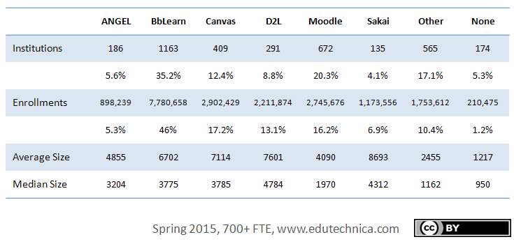

Google:best open source e earning cms 

**混战多年，K12在线教育的故事讲到哪了？**

[鲸准干货](https://36kr.com/user/900325176) *·* 2017-08-25

在线教育机会太好了，而且功德无量。

编者按：本文由微信号[“鲸准”（ID：rong36kr）](http://mp.weixin.qq.com/s/VBizi6DXdnzFpsQELcDVLw)原创，作者梁小妖；经36氪授权发布。

**教育，是一条永不过时的赛道，只要一有机会，就会蹿起来。**

业界称2016年是在线教育元年，虽然很多公司和机构早就在默默耕耘，真正走上战场来的也就在这一年。K12是在线教育中特别重要又极其特殊的领域，是指从小学到高中的12年基础教育阶段，
这一阶段覆盖时间长，用户规模大且属于刚性需求，发展想象力非常丰富。

另一方面，政策的利好（教育投入增加、二胎政策）和互联网技术（大数据、AI）的发展，使得K12教育有太多可以讲的故事。2016年全国K12阶段在校学生数量超过1.8亿，这一人数还将逐渐增加，并且年轻一代的父母们越来越有购买力，接受创新。

于是，在互联网终于入侵传统的不能再传统的教育行业后，K12成为了创业公司最为密集的赛道，各种商业模式不断被探索，“热点”几乎以半年为一周期“更迭”。从在线辅导，到拍照搜题，再到STEAM教育，引发了一波又一波的小高潮。

**然而，学习是件反人类的事情。**

尤其是未成年人这个特殊的群体。不同于文化娱乐和消费生活的欣欣向荣，教育行业尤其是K12，在这条赛道上走的跌跌撞撞，因为K12其实是一种“被（家长）刚需”。

那么，这个市场到底需要什么样的公司呢？或者说哪些公司值得我们关注？

1、资本雄厚的，从而人才聚集，从而产品质量高，从而树立品牌信任背书；

2、善于利用互联网的，推动教学方式的改变（内容表现方式、老师授课方式、学生学习方式），这才是在线教育真正的价值；

3、回归教育的本质，更重视内容的，而且能够通过精品内容实现付费变现。工具可以是流量入口，但内容才是教育行业变现的好生意；

教育是一块巨大的肥肉，各个玩家都想从中分一杯羹。那么，按照上述的3个标准，已经“跑出来”的公司，目前都有哪些玩法？

**在线辅导模式：离变现最近**

切入课堂教学环节的，主要是内容类产品。在线辅导，其实是学生的另一种课堂，是最贴近内容和教育本质的一种模式，也是最容易变现的一种模式，毕竟，通过课程的教学，学生能够实实在在的有所“得”。

从教学内容本身来看，英语和数学这两个学科已经饱和，前者有新东方，后者有洋葱数学，给后来者没有留下创业空间。语文和其他各种副科，是基本没有人做的学科，这个领域里，是别人吃饭，你只能吃剩饭。

所以，在这个领域的竞争其实聚焦在授课模式和教学形态上。目前来看，主要有四种类型：录课、直播、1对1和双师课堂。

录课边际成本低但缺乏激励和互动，直播大课教师质量高但缺乏个性化，1对1个性化好但价格很贵且教师质量一般。线上线下结合的双师课堂相对较好的解决了这个问题，因为它结合了大课名师的优势和个性化的辅导，效果很不错。

这个模式下，跑出了K12领域的第一只独角兽——纯互联网线上玩法的猿辅导。

风头正劲的猿辅导，依托兄弟软件（小猿搜题和猿题库）引流，目前成为了新的独角兽，有系统班、专题课和1对1三种直播课程，提供的课程包括小学英语、奥数和初中高中全学科。猿辅导在2016年实现了上亿元收入（1.2亿），获客成本低，通过低客单价模式，拿到了规模化的入场券。

跟猿辅导抢占市场份额的，一方面是掌门一对一、海风教育、100教育等源源不断的后来者，另一方面是教育行业的两个巨头的虎视眈眈——新东方旗下的新东方在线和好未来旗下的学而思体系。新东方在线在K12领域是一个“后进者”，为了避开一二线城市实力比较强的竞争对手，整体发展将采取“农村包围城市”策略，重点布局三四线城市。

**工具类产品：最大流量的场景入口**

当然内容只是构成整个学习流程的输入部分，学生是否真正掌握了知识还需要靠练习来巩固和测试来检验，只有打通这个闭环才能真正从系统上帮助学生完成学习任务。

于是在课后有两类产品：面向考试的题库类产品，和面向作业的答疑类产品。

题库类产品一直面临两个问题：1、学生到底有没有时间使用手机？2、学习是反人性的，会有学生会愿意去主动刷题么？在目前中国的应试教育的大背景下，这种路子显然是能够行得通，于是，我们看到市面上有猿题库、一起作业、天天练等针对K12的题库，只是各自的切入点不太一样，有的从题库的容量和结构体系入手，有点从学生的体验入手做自适应，帮助学生循序渐进的掌握知识，这个领域的玩家都在各玩各的。

不同于题库类软件，答疑类软件的故事不仅性感，而且竞争激励。作业答疑类的玩法大概有3种：

答疑类产品中目前最好的产品是拍照搜题，因为流量最大。以拍照搜题为场景，通过图像识别技术把学生拍的照片转换为题目，再搜索到答案，积累用户，形成一定活跃度的社区，然后再进行商业变现。这是典型的2C玩法。

以学而思的作业盒子为代表，给学校老师提供批改和作业答疑的解决方案，这种2B模式叫好也叫座，但因为停留在工具层面，很难规模化。

第三种是C2C的平台玩法，做老师学生撮合的平台，这种模式前两年风风火火，但现在已经偃旗息鼓，2015年学大教育和奇虎360共同出资成立的口袋老师还在艰难探索。

流量入口可能是K12在线教育下竞争最激烈，也是最难看的地方。近日，[百度作业帮和小猿搜题之间的互黑互怼发酵猛烈](http://36kr.com/p/5088421.html)，带火了新东方的优答、学霸君、学习宝、阿凡题等一众拍照搜题软件。

近一个月百度作业帮和小猿搜题的搜狗微信热度

**STEAM教育：尚且看不懂**

Steam教育是科学、技术、工程、人文、数学英文单词的首字母缩写。有别于传统单学科、重书本知识的教育方式，是素质教育里除兴趣爱好之外，新兴的一个很重要的分支。其课程种类繁多，市场上主要以机器人教育、自然科学、儿童编程教育为主。

Steam教育对孩子创新、独立思考、动手、有效沟通等能力的培养吸引着众多家长、学校为之买单，国内掀起了Steam教育热。

目前在steam教育收入排名靠前的几家有：做机器人教育的乐博乐博、做科普教育的寓乐湾、德拉学院等，做编程的编程猫；产品提供商乐高中国、Makeblock、邦宝益智等。

图片来源：铅笔道

这个领域最奇特，看似前途光明，但却搞不懂。学生学不懂，家长搞不懂，资本看不懂，大家最大的困惑在于：流行于美国的STEAM教育，在中国到底行不行得通，或者还得等多久才能讲出好商业故事？机器人、编程、AI、VR等高深的创客教育对K12的小朋友们，到底可行不可行？

在创业者频频进入、资本密集轰炸过后，或许能找到一条不错的路子。

 结语：

2016年之前的在线教育的模式更多的是以互联网为工具，把原有的课程，测试等教学内容搬到网上。今年的互联网教育显然往前走了一大步。

不可否认的是，不论是因为近期的“公关大战”，还是资本的重新关注，随着深度学习和人工智能技术的成熟，以知识付费为核心的商业化变现模式清晰，未来K12在线教育势必将迎来新一轮的变革和洗牌。

未来在线教育的核心，应该是大数据的应用及个性化服务。通过大数据构建用户画像，根据用户实际情况提供针对性的服务，从而让用户能够最省心最省力的达成目的。

**在线教育，还没有爆发，就在爆发的路上。**

LMS 在 K12 领域可能需求不大，但占领大学市场是关键
=================================================

[亦大成](https://36kr.com/user/286385) *·* 2015-11-30

LMS平台是在线教育行业的QQ

*导语：美国高校的 LMS
系统都普及了，提供该系统的大公司也出现了不少，基本呈现群雄割据的状态，而且正在向
K12 领域渗透。而国内做 LMS 系统的公司表现都比较低调，但随着企业和教育行业对于
LMS 系统的需求不断增加，该领域出现几家大公司只是时间问题。*

**学习管理系统（**[LMS](http://36kr.com/p/5039555.html)**）主要为在线学习或者培训提供管理，记录，追踪，报告，社交等功能，应用场景主要有学校和企业。**

学校和老师通过 LMS
系统可以实现在线课堂，布置作业，上传课堂资料，师生交互等功能。而企业可以使用 LMS
进行员工培训，员工注册，工作记录等。在**盈利模式上，LMS 系统主要是通过 B
端用户付费并实现盈利，而学生可以免费使用。**

LMS 系统的主要功能：

1.  记录和追踪学习状况

2.  统计报告和能力评估

3.  学习资源管理，容易定制和升级内容

4.  远程教学

5.  学生注册

6.  家校互通

随着 PC 的普及和互联网时代的来临，在美国学校对于 LMS
系统的应用已经有很多年发展历史，其中 D2L 就有 15年
的发展历史。目前主要应用于大学当中，而近几年也在往 K12 市场拓展。而国内市场的
LMS 系统主要是以题库的模式为主。

**美国 LMS 发展概况**

**从美国的校园 LMS
系统的发展来看，最早是从大学开始切入。主要由于大学校园电脑普及度高；师生比例较低（尤其是公立大学），老师对学生作业线下批改的时间成本高；共享教学资源等原因**。近几年LMS
系统开始渗透到 K12
领域，而美国政府对于数字化教学系统的建设也有很大支持力度，比如对于学校网速的提高。据[EducationSuperHighway](https://www.edsurge.com/news/2015-11-19-america-s-classrooms-online-24-5-million-students-now-up-to-speed)报告显示，美国有超过
77%的学区网速达到 100kbps。

**美国主要 LMS 公司历史和发展现状**

**Angel**：主要用于在线教学，线上线下混合式教学，作业管理，课件分享等。企业级用户主要将
Angel 系统应用于员工在线培训。该系统目标用户为大学，社区学院和 K12 学校。

Angel 系统最初是基于大学的调查系统开发而来，在 2000年 由 Cyberlearning Labs
开发。2009年 被竞争对手 Blackboard Inc 收购。目前 Angel 系统拥有机构用户 186
家，注册用户超过 89 万人。

**Blackboard
learning：**是一款学科管理软件和在线学习平台，通过该系统可以实现学生信息管理和身份认证等功能。其最主要的特点是具有交互和内容分享，通过
Blackboard
用户可以发起聊天，讨论，收发邮件，发布公告等。在内容管理方面，该系统可以实现在线课堂，成绩管理，数字图书馆，作业等功能。

Blackboard Inc 成立于 1997年，由 CouseInfo LLC 和 Blackboard LLC
两家致力于发展在线教育的公司合并而成。目前该公司已经成为最大的 LMS 机构，在
2014年 有 80%的高等教育机构在使用 Blackboard 的系统；在美国拥有用户超过 770
万；支持 92%的在线本科学历学习项目。

**Canvas：**通过 JQuery，HTML5，CSS3
为用户提供了更现代化的使用界面。开放授权的应用使用户可以在 Facebook 和 Twitter
等社交网站之间产生交互。除 Canvas 之外，Instructure
Inc.还拥有其他两款产品，比如针对 K12 的 LMS 平台 Canvas K-12，还有 MOOC 平台
Canvas Network。

Canvas 系统由 Instructure 公司开发，该公司成立于
2008年，创始人是两名杨百翰大学的研究生。2010年UEN（Utah Education Network）宣布
Instructure 将替代 Blackboard 成为他们首选的 LMS 系统。在 2011年 发布了 LMS
开源软件 Canvas，目前已经成为增长速度最快的 LMS，有超过 400 所大学使用 Canvas
系统。其用户主要是学费相对较低的公立学校。

**Desire2Learn**：是在线授课和学习平台。其优点主要是可以随时查看学生的表现；快速上传课程内容；限制查看特定内容；学生可以随时参与到学习；在线限时测试和自动批改，并且给出分析数据。

D2L 在 1999年 成立于加拿大，在 2012年 拿到 8000 万美元 A 轮融资，B 轮融资 8500
万美元在 2014年 完成。目前全球范围内拥有 1500 万学生用户。

**Moodle：**是一个为教育人员，管理人员，学生提供的学习平台，具有较强的兼容性和易用性。通过集成的系统为用户提供个性化的学习环境。Moodle
可以帮助教育者建立有效的在线学习社区。除此之外，Moodle
还具有多语言能力可以保证用户的在线学习不受语言限制。

Moodle 系统最早是由 Martin Dougiamas
开发，目的是为了帮助教学人员可以创建在线课程并且实现协作和交互。Moodle 的 1.0
版本版本在 2002年 开发完成并且上线。目前 Moodle 拥有 670 多家机构用户和 270
万注册用户。

**Sakai：**是一款开源 LMS 软件，功能主要有学习，教学，调查，协作。在 Sakai
背后是由来自世界各地的开发者社区支持，通过技术不断提高和完善 Sakai
的教学，学习，调查系统。

在 2004年，Sakai
项目在四所大学的主导下成立，该项目致力于为大学开发一款开源教学和学习软件。其最早的版本是基于当时已有的工具整合到
Sakai
平台而成。开发成员包括密歇根大学，印第安纳大学等高校。目前在美国市场拥有注册用户超过
100 万，机构超过 130 家。

2015年 美国 LMS 市场主流公司的用户和市场份额数据如下：

从用户数据上来看，Bblearn 用户超过 700 万占据了大部分份额；第二梯队的
Canvas，D2L，Moodle 全美注册用户数量都超过 200 万人；第三梯队的 Angel 和 Sakai
用户数量都在 100 万左右。

**中国 LMS 系统发展现状**

与美国相比，中国的 LMS
系统发展相对较晚。但是随着基础设施，教育技术，电脑普及程度的不断发展，LMS
系统会有更快的普及速度。近几年中国 LMS
系统的发展状况来看，无论是产品还是市场的切入点都呈现出多样化的特点。

据 36 氪了解，目前中国的 LMS
系统主要由几家上市公司提供，包括科大讯飞和武汉颂大。另外校方也通过外包的方式进行
LMS 的建设。除此之外，腾讯 10月
份推出的[智慧校园](http://36kr.com/p/5038634.html)项目希望通过微信平台为学校提供一套
LMS
系统。从其产品功能来看，主要围绕校园生活展开，并且与微信支付的结合比较深入。还有智园控股
2013年 成立于香港，是一家教育软件开发公司，为高等院校和 K12
校务管理提供整体解决方案。并在今年8月 份获得全通教育的 2217.5 万元投资。

**由于 K12
市场门槛相对较高，对资源依赖度比较大。所以目前大多数公司试图通过题库工具切入 K12
校园市场。**选择题库切入学校市场主要是由于 K12
教育作业的痛点较多，通过题库系统可以解决：第一，老师批改和统计作业耗时较多；第二，优秀题库资源共享；第三，通过标准化辅助措施提高教学质量。在
To B
的题库领域主要有[学科网](http://36kr.com/p/5038227.html)和[一起作业网](http://36kr.com/p/531248.html)，其中学科网在今年10月
份获得了[好未来](http://36kr.com/p/5038788.html)3000
万美元战略投资，并有可能寻求独立上市。一起作业网在今年获得了一亿美元融资，并且已经覆盖
3 万多所小学，学生用户达到 700 万。

**K12 领域另外三家提供 LMS 平台的创业公司**

**极课大数据：**服务于基础教育的学业采集与学情追踪反馈系统，目前用户主要集中在
K12 市场，用户分布在北京、上海、深圳和江苏等省份和城市。公司成立于 2012年，并于
2014年12月 获得学大教育投资。

**狸米学习：**专注于中小学教育的个性化学习平台。以线上评测为切入点，为公立学校提供教学解决方案，其中包括课堂教学、评测，课后辅导等教学场景。公司成立于
2014年，并于 2015年11月 获得北极光创投的数百万美元天使投资。

**米学网：**为学生，老师，家长提供智慧教育一站式互动平台，
涵盖教育信息化管理、在线教学资源、学生成长档案和家校互动等应用。公司在 2014年
成立，并在 2015年2月 份获得融资。

目前 LMS 市场和发展状况来看，虽然 LMS 市场的进入门槛相对较高，但是 LMS
作为教育工具的确能凭借技术优势帮助老师，学校，学生解决不少工作，管理，学习等方面的问题。另一方面，对于教学水平的提高也有很大的辅助作用。所以校方对
LMS
的引入和应用也只是时间问题，并且随着智能手机的普及，在硬件方面使用门槛将会被降至很低。

**中国 LMS 系统的未来发展**

短期之内，国外的系统进入中国市场存在难度。首先是缺乏政府资源，其次是中文题库的建设，本地化资源和用户使用习惯也将会对国外公司形成一定的门槛。我认为
LMS
系统的发展，首先从内部需要政府的政策支持。从外部来看，创业公司可以通过解决用户痛点的方式切入市场，除此之外软件外包公司可以加强与学校的合作，通过与学校合作的方式推广
LMS 平台。
