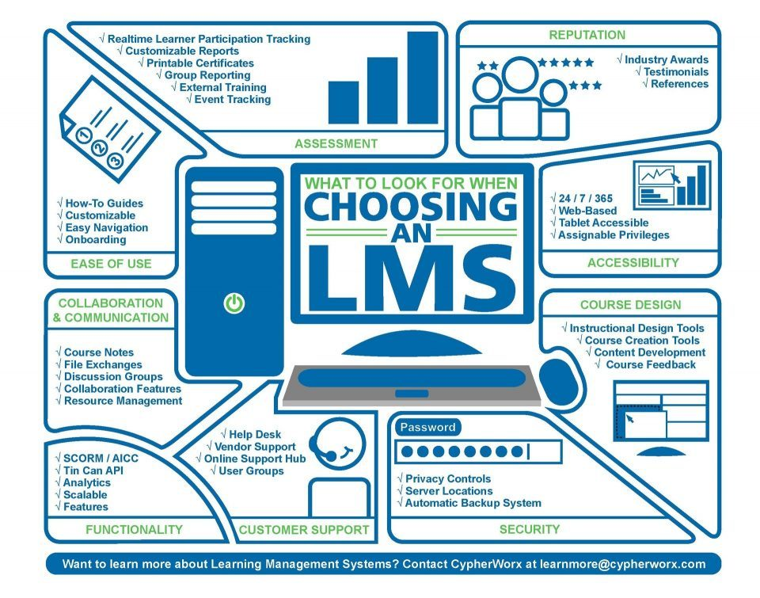
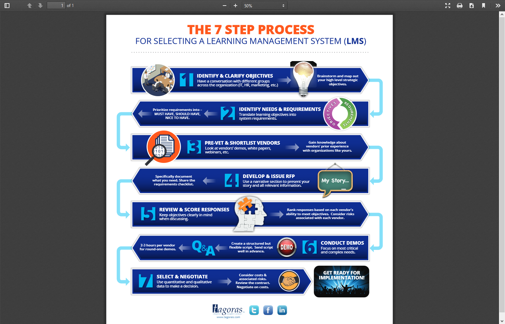
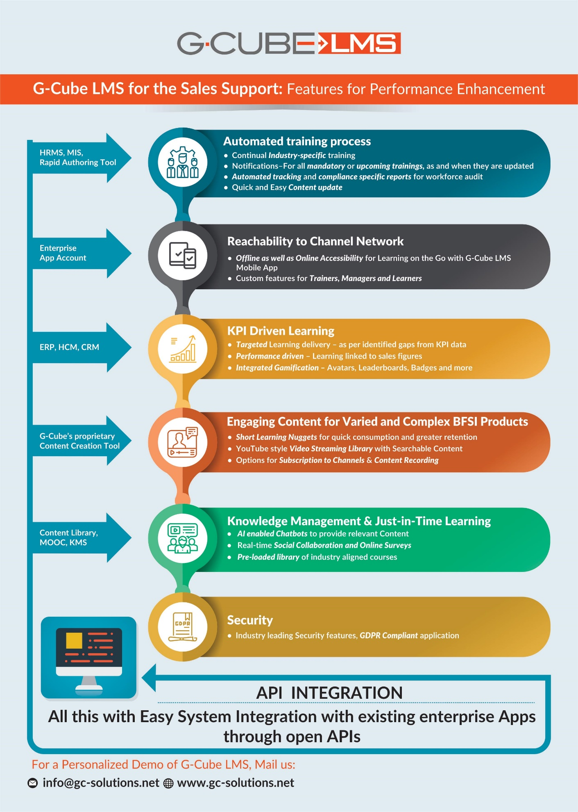
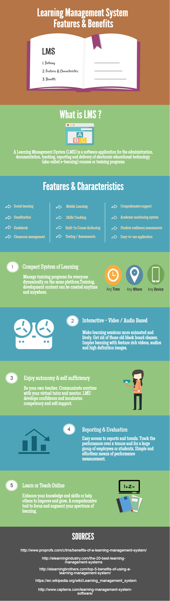
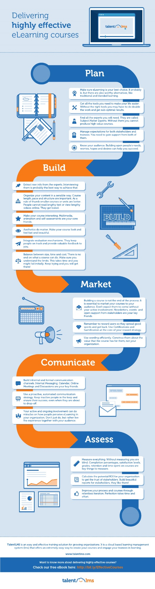
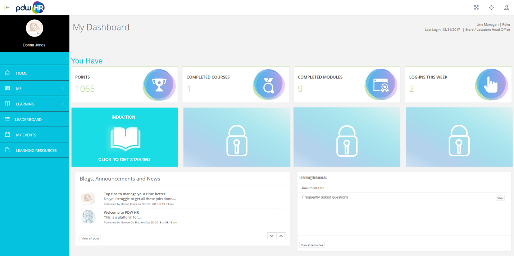
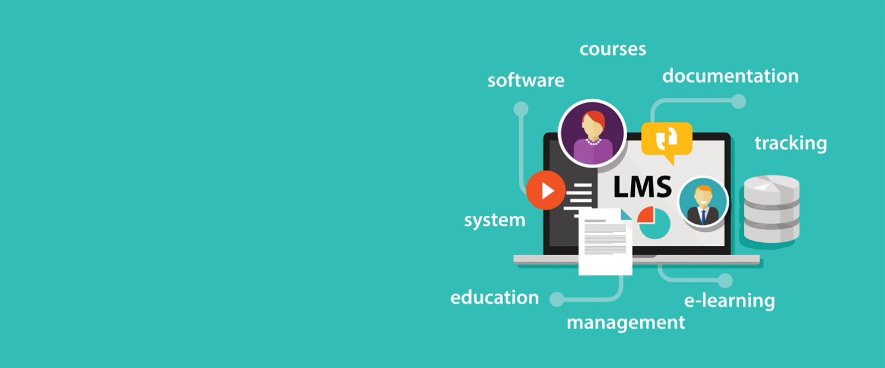
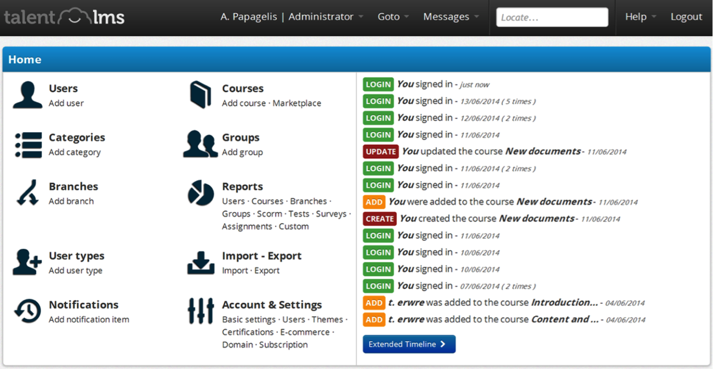
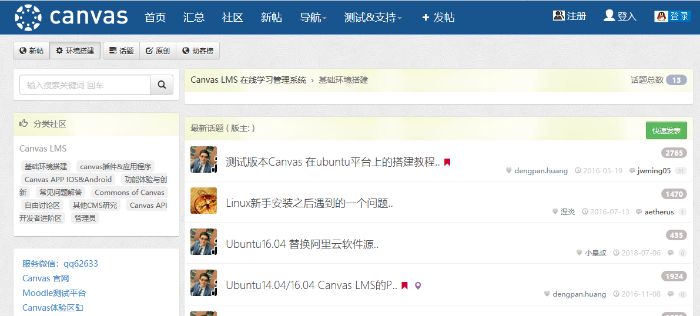

A **learning management system** (**LMS**) is a [software
application](https://en.wikipedia.org/wiki/Software_application) for the
administration, documentation, tracking, reporting and delivery of
[educational](https://en.wikipedia.org/wiki/Educational) courses, training
programs, or learning and development
programs.[[1]](https://en.wikipedia.org/wiki/Learning_management_system#cite_note-ellis-1)
The learning management system concept emerged directly from
[e-Learning](https://en.wikipedia.org/wiki/E-learning_(theory)). Although the
first LMS appeared in the higher education sector, the majority of the LMSs
today focus on the corporate market. Learning Management Systems make up the
largest segment of the learning system market. The first introduction of the LMS
was in the late
1990s.[[2]](https://en.wikipedia.org/wiki/Learning_management_system#cite_note-:0-2)

Learning management systems were designed to identify training and learning
gaps, utilizing analytical data and reporting. LMSs are focused on online
learning delivery but support a range of uses, acting as a platform for online
content, including courses, both asynchronous based and synchronous based. An
LMS may offer classroom management for instructor-led training or a flipped
classroom, used in higher education, but not in the corporate space.

http://elearning-praxis.de/learning-management-system-features-and-benefits-infographic/

https://www.talentlms.com/blog/effective-elearning-courses-infographic/

